# The architectural decision map

**What every decision in the OMR pipeline knows, what it is allowed to use,
what it produces, who reads that, what it depends on, and what it must not be
allowed to hear from.**

Commissioned by Sean, 2026-09-07:

> *"It feels to me like we need a map of every recognition point, every time
> there is a decision and a list of what information that decision needs as well
> as a tracking of how each piece of information is used once it is gathered and
> where it should be used. … **We need the architectural blueprints.**"*

and, the same day:

> *"An important part of that map would be dependencies with a best order — or
> what should be done in parallel — and interreferential."*

**Read one section before building one thing.** This is not a cover-to-cover
document. §2 tells you where in the pipeline your thing sits; §3 tells you what
must already be true before it can work; §4 tells you whether you are standing
in a cycle; §5 is the decision itself; §6 tells you whether the information you
are about to gather already exists and is being thrown away.

⚠️ **No pipeline behaviour was changed to write this.** It is documentation
plus one read-only probe (`benchmarks/omr-decision-map-2026-09/verify.py`).

⚠️ **ADVERSARIALLY VERIFIED 2026-09-07**, at Sean's instruction, because a wrong
entry here will be believed and built on:
[`benchmarks/omr-decision-map-verify-2026-09/FINDINGS.md`](../benchmarks/omr-decision-map-verify-2026-09/FINDINGS.md).
≈93 entries checked; the mechanical half held (all 27 §8 rows re-derived from
code, 24 exactly, 3 narrowed), and **11 errors were found and corrected in
place** — every one of them a *negative* about consumers, plus three whole
stages §5 had dropped. Corrections are marked inline. **The measured half —
every quoted figure in §5 and §7 — was NOT re-run and is unverified.**

---

## 0. How to read a row, and what the labels mean

⚠️ **Corrected 2026-09-07: this is the INTENT, not the state.** Six of §5's
twelve tables carry no `CONSUMED BY` column — see the warning at the head of
§5, which names them and says why it matters.

Every decision point in §5 carries the same ten fields. Three of them are the
reason this document exists.

| field | what it is for |
|---|---|
| **DECIDES** | one sentence |
| **CONSUMES** | the inputs actually read, verified in code |
| ⚠️ **BLIND TO** | what is in scope at that moment and is **not** read. **The most valuable column.** |
| **PRODUCES** | the field it writes |
| ⚠️ **CONSUMED BY** | who reads that — `NOBODY` where that is the truth |
| **SHAPE** | the A–E class below, plus gate / additive / vote / abstention |
| **DEPENDS ON** | what must already be settled for this to run at all |
| **PROVENANCE** | which evidence tier it produces or consumes |
| **CONSTANT** | the magic number and whether it sits on a measured gap |
| **FLAG** | the env var that changes it |

### 0.1 The five-class taxonomy — reused, not reinvented

From [`docs/handoff-probability-gates-2026-09-05.md`](handoff-probability-gates-2026-09-05.md).
Do not invent a rival vocabulary.

| | fault | repair |
|---|---|---|
| **A** | the probability is **never formed** — a boolean veto with no score behind it | compute and record the score; the gate may stay |
| **B** | formed, then **quantised** to a label before anyone uses it | carry the float to its consumer |
| **C** | formed, kept, **consumed by nobody** | give it a consumer, or say why it has none |
| **D** | used only as an **exclusive tier or a raw argmax** | a tie-break or a term under the tier |
| **E** | an **all-or-nothing structural refusal** | usually correct — see the constraint/opinion test |

⚠️ **A class is not a verdict.** The criterion for whether a site *should*
change is in
[`benchmarks/omr-additive-vs-gated-2026-09/FINDINGS.md`](../benchmarks/omr-additive-vs-gated-2026-09/FINDINGS.md)
§1, and it is one line:

> **A gate is a "stain" only when it encodes one fallible reader's OPINION.
> When it encodes a CONSTRAINT of the domain it is not a stain, it is
> information — and the strongest kind, because it is the only kind that
> cannot be wrong.**

A monotone alignment cannot reorder staves; a player cannot sound a pitch
outside the instrument's range; two equal-cost mappings that disagree carry
literally zero information. Those are constraints. A symmetry score, an NCC
template match, a detector confidence, an OCR string, a distance to a staff
band — those are opinions.

### 0.2 The provenance tiers, and why the field is load-bearing

`instrument_source` is the field that carries this, and it is already
load-bearing — it was the discriminator that stopped the label-contradiction
check reporting our own landed fixes as defects.

| tier | means | may it feed a clef decision? |
|---|---|---|
| `label` | read off this page's margin | yes |
| `score_order_ambiguity` | a label the layout prior disambiguated | yes (admitted deliberately, `contextual.py:1377`) |
| `roster` | the work's roster, matched to this staff | **held out by default** (`OMR_ROSTER_CLEF=0`) |
| `score_order` | deduced from position alone | **never** — `contextual.py:1380` |
| `catalog` | IMSLP work/edition page, independent of any encoding | measurement paths may use it |
| `encoding` | derived from a MusicXML | a measurement path may **not** use it |
| `page` | read off a raster — i.e. an OMR output | a measurement path may **not** use it |

⚠️ **The last three are the score-library tiers** (`source_kind`), not the
identity tiers, and they govern what a *benchmark* may read rather than what a
*decision* may read. Both are in this table because both are called
"provenance" in the codebase and confusing them is easy.

---

## 1. The pattern this document exists to kill

Not detection failure. **Information correctly gathered and then silently
unused.** The evidence is already written down and this map's job is to make it
visible by construction:

- **Nine "detected, then dropped on the way out" export gaps**, each found by
  forensics, none by a test — numbered in `tools/omr/export_coverage.py`.
- `grep -c '\bconfidence\b' tools/omr/export.py` **returns 1, and that one
  occurrence is a comment** — reproduced here as check `[V1]`. The exporter
  treats a notehead detected at 0.26 and one at 0.98 as equally true, and on a
  scan **29.7% of detections are under 0.40**.
- **Four of the five internal-consistency checks reach no consumer at all**
  (`[V2]`). On the two standing benchmark families, **140 scan / 21 engraved
  signals are computed and inert**.
- **~20 sites compute a real number and discard it at the moment they refuse** —
  the additive-vs-gated survey's list, reproduced in §7.
- And the worked example from 2026-09-07: an identity replay that is
  **clef-blind** resolves an ambiguous `Tp.` to Trumpet and overturns a correct
  label document-wide; handed the real bass clef it declines and the label
  stands. **The clef channel is worth 51 records on that work where the label
  channel is worth 0**, and 58 of the identity harness's 59 arms silently drop
  it ([`benchmarks/omr-readpass-monotonicity-2026-09/FINDINGS.md`](../benchmarks/omr-readpass-monotonicity-2026-09/FINDINGS.md)).

---

## 2. The spine — what happens to a page, in the order it happens

Stage numbers match `docs/progress-dashboard.html`'s flow graph so the two can
be read together. Line numbers are `tools/omr/transcribe.py` at `e1107b5b`.

| # | stage | the call | line | scope |
|---|---|---|--:|---|
| 1 | Render + staff detection | `render_page` → `detect_staves` | 4170–4171 | page |
| 2 | System grouping | inside `detect_staves` → `system_grouping` | — | page |
| 3 | Measure + barline extraction | `detect_barlines` → `extract_measures` → `resegment_fused_measures` | 4173–4194 | page |
| 3b | Staff-line removal (for the CV consumers only) | `remove_staff_lines(cells)` | 4198 | cell |
| 8a′ | **Header clef, for the key-signature slot table only** | `locate_clef` / `_read_staff_header` | 4286–4309 | staff |
| 8b | Header key signature | `_header_key_signatures` | 4323 | staff |
| 4 | Symbol detection (YOLO, per cell) | `_detections_for_cell` | 4490 | cell |
| 5 | Stems + beams (classical CV) | inside `_detections_for_cell` → `line_detection` | — | cell |
| 6 | Pitch resolution | inside the cell loop → `pitch_resolver` | — | cell |
| 7 | Rhythm / durations | inside the cell loop → `rhythm.resolve_rhythms_for_cell` | — | cell |
| 4b | Tie pairing across barlines | `_pair_ties_in_staff` | 4615 | staff |
| 4c | **Ownership: unladdered noteheads dropped** | `_drop_unladdered_noteheads` | 4682 | page |
| 4d | **Ownership: cross-staff duplicates resolved** | `_dedupe_cross_staff_detections` | 4689 | page |
| 3c | System furniture read as a measure, dropped | `_drop_furniture_measures` | 4704 | page |
| 8c | Time signature: dossier override, then vote/backfill | `apply_meter` → `backfill_page_time_signatures` | 4719–4724 | page |
| 7b | **Meter → rhythm feedback** | `_reconcile_page_to_meter` | 4752 | page |
| ✚ | Rhythm-sum check | `_annotate_column_rhythm_warnings` | 4769 | page |
| ✚ | Four cross-staff consistency checks | `_flag_*` ×4 | 4788–4791 | system |
| ✚ | Dossier checks (when supplied) | `dossier.*` | ~4795 | page / run |
| 9′ | Direction text (OCR over subtracted ink) | `read_directions` | 4939 | page |
| 9,10 | **Margin labels → instrument → slot → identity** | `apply_contextual_analysis` | **4970** | **document** |
| 4e | Roster-fed range veto (off by default) | `_apply_roster_range_veto` | 4995 | document |
| 11 | Export | `tools/omr/export.py`, separate entry point | — | document |

⚠️ **Rows marked ✚ produce nothing the pipeline consumes.** They are the
consistency checks. They are in the spine because they *run*, not because
anything downstream is different for their having run.

⚠️ **Read the stage numbers as identity, not as order.** Stage 8a happens
*twice* and the two are different decisions: a header clef is read at 4286
solely to choose the key-signature slot table and **is not written to the
output** (`transcribe.py:4243-4246`), while the clef that reaches the output is
read again inside the measure pass. Stage 9/10 (identity) runs **last**, after
every pitch is already resolved. That is §3.2's central finding.

---

## 3. The dependency axis

### 3.1 Hard dependencies — what genuinely cannot be reordered

These are physical or arithmetic, not historical.

```
render ──▶ staff detection ──▶ system grouping ──▶ barlines ──▶ measure cells
                    │                                              │
                    │                                              ▼
                    │                                    canonical cell rescale
                    │                                              │
                    ▼                                              ▼
            staff.line_ys  ─────────────────────────────▶  YOLO detection
                    │                                              │
                    ▼                                              ▼
              header window ──▶ CLEF ──▶ key-signature slot table  │
                                  │                        │       │
                                  └────────┬───────────────┘       │
                                           ▼                       ▼
                                     PITCH  ◀──────────────  notehead y
                                           │
                                           ▼
                        beams/flags/dots ──▶ DURATION ──▶ meter vote
                                           │                  │
                                           │   ┌──────────────┘
                                           ▼   ▼
                                 meter → rhythm reconciliation
                                           │
                                           ▼
                                      identity (contextual)
                                           │
                                           ▼
                                        export
```

Named, because each has bitten someone:

| dependency | why it is hard | evidence |
|---|---|---|
| staff detection → **everything** | a cell is defined by `staff.line_ys`; nothing has coordinates without it | — |
| system grouping → barline vote | "every staff in a system shares its barlines" is the whole vote | `_flag_measure_count_inconsistency` |
| **clef → key signature** | the slot table is *chosen* by the clef; fitting against a guessed clef read three flats as **two sharps** | `transcribe.py:4243-4246`, in the code comment |
| **clef → pitch** | a clef transposes every note on its staff | `clef_correction.apply_proposal` restates them |
| pitch → register checks | a range veto needs resolved MIDI | `_staff_written_ranges` |
| duration → meter vote | the meter is voted out of resolved lengths | `backfill_page_time_signatures` |
| **meter → duration repair** | `_reconcile_measure_to_meter` needs the meter it is repairing against | 4752, deliberately after 4724 |
| detections → direction text | it works by **subtracting** every detection from the page's ink | `direction_text._blank_detections` |
| identity → range veto | named staves are the whole input | 4995, "strictly after the contextual pass" |
| slots → export part names | a part is the same staff on every system | `export._stitch_slots` |

### 3.2 ⚠️ Sequenced by accident, not by necessity — where the leverage is

**This is the section to read if you are choosing what to build.**

#### (a) Identity runs last, and roughly half of it need not

`apply_contextual_analysis` is at line **4970** — the last substantive call —
and its own comment says why:

> *"It is a POST-PASS over the built page dicts: a clef hypothesis is arithmetic
> on already-resolved pitches, so nothing about detection, rhythm or
> segmentation changes … **It runs last for that reason.**"*

The reason is real **for the register half** and false for the rest. Identity's
evidence splits cleanly:

| evidence | needs pitches? | could run at stage 1–3 |
|---|---|---|
| margin labels (text layer / Surya / Vision) | **no** | ✅ |
| bracket structure, staff counts | **no** | ✅ |
| score order / position prior | **no** | ✅ |
| work roster (`work_roster.py`) | **no** | ✅ |
| register fit against an instrument's range | **yes** | ❌ stays late |
| clef-vs-instrument correction | **yes** (it restates pitches) | ❌ stays late |

**The cost of the current order is measured.** `clef_correction`'s FILL tier
fires only where no clef was read, which is 34 of 396 staves (8.6%); replayed
over the standing corpora it produced **5 proposals on 193 scan staves and
applied 0** — the tier reached **nothing, in either family**
(additive-vs-gated §4.5). Meanwhile the documented pipeline ceiling is clefs
read **wrong**, a population the fill tier cannot see by construction.

This is `docs/scope-identity-upstream-2026-09-06.md` §3's phase (a), and this
map is evidence for it: **the pitch-free half of identity has no dependency
holding it at line 4970.**

#### (b) The header clef is read twice and the first read is thrown away

At 4286 a clef is read from the header crop *solely* to pick the
key-signature slot table, and the comment says plainly: *"it is not written to
the output, and the measure pass below still reads the clef its own way."*
Two independent readings of one fact exist at runtime and **they are never
compared.** That comparison is free and is exactly the shape
`contextual._fill_defaulted_clefs` already uses across systems.
⚠️ **UNMEASURED** — nobody has counted how often they disagree.

#### (c) The consistency checks run at the end of a page and could run anywhere

All four `_flag_*` calls (4788–4791) are pure functions over the finished page
dict. They are last because that is where they were added, not because anything
needs them there. Since **nothing consumes them**, their position is currently
irrelevant — but if any becomes an evidence term, it will need to run before its
consumer, and the only real constraint is *after* the pass whose output it
reads.

#### (d) Export is a separate entry point and therefore a separate era

`export.py` runs from a stored JSON. That is why nine signals could be read
correctly and dropped on the way out without a single test noticing: **the two
halves are never exercised together except by a benchmark.** It is also why the
export gaps were cheap to fix once found.

### 3.3 What can run in parallel

| these are independent | why | note |
|---|---|---|
| **pages** | every page is rendered, detected and assembled independently until 4970 | the ONLY document-scope consumers are `apply_contextual_analysis`, the run-level dossier check, and `_apply_roster_range_veto` |
| the three **margin-label readers** | cheapest-first cascade, not a fusion | ⚠️ they are *deliberately* serial: `contextual._labels_for_page` only pays for the next rung when the free one returns empty. Parallelising them would spend money the cascade exists to save |
| **direction text** and **identity** | direction text reads ink minus detections; identity reads labels and pitches | both are post-passes at 4939 / 4970, neither reads the other |
| **key signature** and **time signature** readers | different header sub-windows, different templates | both depend on the clef read at 4286 only for the key half |
| the four **consistency checks** | pure, no shared state | |
| the **CV rungs** (stems, beams, hairpins) and **YOLO** | they read *different images* — CV takes the staff-line-erased cell, YOLO the original | ⚠️ **do not "unify" this**: erasing staff lines before YOLO was measured at −7 to −13 reading points and up to a third of the noteheads |

⚠️ **Nothing here is currently parallelised in code.** The pipeline is a single
serial loop; this table says what *could* be, not what is. The measured cost
centre is elsewhere: on a whole-work run **direction text is ~75% of wall
clock**.

---

## 4. Interreferential — the genuine cycles

⚠️ **These are not ordering problems with a right answer.** Presenting them as
"just do X first" is how the loop gets closed on its own mistake. Each is a real
cycle; what follows is what the codebase already does about it, which in three
cases is a hard-won refusal.

### 4.1 The governing rule

From `docs/scope-identity-upstream-2026-09-06.md` §7, and it is the single most
important sentence in this document:

> **The safety constraint is PROVENANCE, not topology.** It is not enough that
> the control flow has no cycle; the **evidence** must have no cycle. A message
> may be consumed only by a process whose own output did not contribute to it,
> and **two signals sharing an ancestor are ONE signal**, not corroboration.

With §8b's amendment, which supersedes it wherever they conflict: a dissenting
process **lowers a total, it does not veto** — but correlated evidence is
**counted once**, which is the additive expression of the same fact.

### 4.2 The cycles, and the state of each

#### Cycle 1 — identity ⇄ clef

```
   instrument name ──▶ "violas read alto" ──▶ clef ──▶ pitch
          ▲                                            │
          └──────── register fit ◀─────────────────────┘
```

**Refused, three times independently, and the three refusals are the best prior
art in this area.** Verified at `e1107b5b` by check `[V5]`:

| where | line | the edge it refuses | verbatim |
|---|--:|---|---|
| `tools/omr/clef_correction.py` | **396** | deduced identity → clef | *"Both act only on identity a reader actually READ off the page (**never score-order deductions — measured to close the loop on its own mistake, Beethoven 5 p.15**)"* |
| `tools/omr/dossier.py` | **434** | clef → part↔staff join | *"**The evidence is the margin labels, deliberately, and never the clefs.** Clefs are what this join exists to supply, and scoring the join on them would be circular exactly where it matters."* |
| `tools/omr/score_layouts.py` | **682** | clef → layout pin | *"**a clef — never.** Supplying clefs is what the join exists to do, and pinning on them would be circular exactly where it matters."* |

⚠️ Note the two directions are **not** symmetrical, and the codebase gets this
right: `dossier` and `score_layouts` refuse *clef → identity*;
`clef_correction` refuses *deduced identity → clef*. **Read identity → clef is
permitted**, and so is clef → identity where the clef is a reader's and the
identity is a different observation — `contextual` sets
`clef_source = "slot_continuity"`, taking a staff's clef from the same part's
reading on another system, measured 48/52 → 49/52. Two independent looks at one
fact.

#### Cycle 2 — the same cycle, resolved the RIGHT way, with a number

2026-09-07, Beethoven 5 / Litolff, whole work. `Tp.` is Timpani **or** Trumpet.
The tie is broken by asking `fit_layouts` what sits at that position — and
`fit_layouts` takes `clefs=clef_by_slot` (`contextual.py:1076`).

| the fit is handed | it proposes at ordinal 8 | the ambiguous alias resolves to | identity |
|---|---|---|--:|
| **no clefs** (a replay) | `Trumpet` | `Trumpet` — the label is overturned **document-wide** | 0.9368 |
| **the real run's clefs** | `Trombone` | `None` — not a candidate, so the label stands | **1.0000** |

**+51 records from the clef channel; 0 from 11 extra labels.** The circularity
control is explicit and passes: `_read_clefs_by_slot` admits a staff only if it
carries `clef_source`, and `clef_correction` never writes that field — the
admitted rows are `detector` 1220, `detector_header` 96, `cv_locator` 52
(readers) plus **one** `slot_continuity`, and dropping that one changes nothing.

**So "identity needs clefs" is a measured dependency, not a theoretical cycle** —
and the safe form is the one used here: clefs *a reader read*, never clefs an
identity produced.

#### Cycle 3 — pitch ⇄ clef ⇄ register

```
   clef ──▶ pitch ──▶ register ──▶ "that clef cannot be right" ──▶ clef
```

⚠️ **Both arrows are measured weak. Do not build on this.**

- `range → instrument`: a family's range is the UNION of its members', so
  percussion spans 0–127; across the scan corpus only **5 detected pitches of
  9,219** fall outside their family union.
- `range → clef` via `clef_register_warning`: **reach 7 of 193 scan staves, and
  precision 0 of 11.** Every firing is a *family boundary* — bassoon above horn,
  timpani above violin — because an orchestral score is ordered by family, not
  by register. `docs/scope-identity-upstream-2026-09-06.md` §9 nominated it and
  then refuted it the same day. **Do not resurrect the ADJACENT-PAIR form.**

What survives: the check is Class C (computed, unconsumed) and that is still a
defect of the same family. What does not survive is that consuming *this* form
would help.

⚠️ **Scope of the refutation, narrowed 2026-09-07 under
`docs/backlog-2026-09-07-open-items.md` §A00** (*a worse score does not condemn
the mechanism*). What was measured is **one form** — the adjacent-staff register
comparison — on **n = 11 firings**, and the source itself says "in every form
tried so far". §9.4 of this document names two untried variants (restricted to
one bracket group; a staff against **its own** reading on other systems) and
requires a reach measurement first. The earlier flat "do not resurrect it"
contradicted §9.4; this wording is the one to carry.

#### Cycle 4 — meter ⇄ duration

```
   durations ──▶ meter vote ──▶ meter ──▶ re-read a beam level ──▶ durations
```

**Resolved, and the resolution is the model for the others: bound the edge so
narrowly that it cannot launder a guess.** `_reconcile_measure_to_meter` may
re-read a beam level by **±1 only**, the corrected bar must land **exactly** on
the meter, the answer must be **unique**, single-voice measures only, and every
change is recorded as `rhythm_reconciliation`. It never adds, deletes or
re-pitches a note.

Note the parallel with the identity cycle: the dangerous version is *the meter
inferred from these very durations then repairing them*, and the guard is that
a dossier meter (external truth) is applied **first** (4719) so inference is
left with nothing to guess at.

#### Cycle 5 — ownership ⇄ identity

`_dedupe_cross_staff_detections` (4689) awards a contested glyph, and its
strongest available tier — the instrument's written range — needs identity,
which runs 281 lines later at 4970. The code resolves this by **deferring**: a
contested pair that distance alone decided is parked and re-examined by
`_apply_roster_range_veto` at 4995, *after* identity. ⚠️ That deferred pass is
`OMR_ROSTER_RANGE_VETO`, **off by default** — measured 52 swaps for +24 edits.
So today the cycle is cut by simply not using the identity tier at all.

#### Cycle 6 — the shared-server hazard (process, not evidence)

Not an information cycle but it costs whole runs: the Surya keep-alive server is
**one per machine**, `--serve` detaches to ppid 1 by design, and
`pkill -f llama-server` has destroyed a sibling agent's multi-hour
transcription. Use `--stop`, or `OMR_SURYA_KEEP_ALIVE=0` for an unattended run.
**Never blanket-kill by name.**

### 4.3 The standing hazard nobody has designed for

A per-**system** refusal guarding a document-**wide** write.
`_resolve_ambiguous_labels` refuses an overturn on a system that names the
proposed instrument under another alias — a per-system test — but the overturn
it performs writes `instrument_by_slot[slot]` *and* the reference itself, for
the whole document. On Beethoven 5: **80 `Tp.` labels, 73 blocked, 7 not** —
and those 7 systems carried the name across all 88 pages, with 51 judgeable
records inheriting it. Latent today only because with clefs the overturn never
fires.

---

## 5. The decision catalogue

**Depth is uniform by design.** Each row gives the decision, what it is blind
to, what it produces and who reads that, its A–E shape and its dependency.
Where a row needs more, it names the file:line — the code is the authority and
this is an index into it, not a replacement for it.

⚠️ **Read the ⚠️ column first.** It is the one the commission exists for.

Legend for the consumer column: **`NOBODY`** = nothing reads it anywhere;
**`probe`** = only a benchmark or test; **`app`** = it crosses into
`backend/`/`frontend/`. ⚠️ **Use `probe`, not `NOBODY`, the moment a benchmark
reads the field** — the difference decides whether a signal can be priced from
disk, which is what §9.5 item 1 turns on. Three cells got this wrong and were
corrected 2026-09-07.

⚠️⚠️ **SIX OF THE TWELVE TABLES BELOW HAVE NO `produces → consumed by` COLUMN,
and §0's "every decision point in §5 carries the same ten fields" is therefore
false.** The six are **8a (clef), 8b (key signature), 8c (time signature),
9 (labels → instrument), 10 (slots + identity) and 11 (export)** — i.e. the
whole identity-and-export half, which is where **every one of §9.5's six
shortlist items lives**. So the question this document exists to answer —
*"what consumes my output — does anything?"* — is **unanswerable from §5 for
exactly the areas §9 tells you to build in**. Reproduce with
`grep -n "^| decision (file:line)" docs/architecture-decision-map.md`.
Filling the column is mechanical (the same grep `V6` already runs) and is the
single largest usability improvement available to this document.

---

### Stage 1 · Render, binarise, deskew — `preprocessing.py`

| decision (file:line) | decides | ⚠️ blind to | produces → consumed by | shape |
|---|---|---|---|---|
| `render_page` channel dispatch `:40` | how to read the pixmap | `pix.colorspace`, `page.rotation`, `page.get_text()`, and ⚠️ **`input_domain.py` sits in the same package unconsulted** | RGB → internal | D |
| `binarize` Sauvola `:90` | ink or paper, per pixel | ⚠️ **the DPI.** `window_size=25` is a fixed PIXEL window, so at 600 dpi it spans a third of the staff spaces it spans at 300 — and `OMR_DPI` legitimately varies 300/600 | `PageImage.binary` → everything | A (the threshold *map* is computed and discarded) |
| `deskew` Hough accept `:112` | is there a near-horizontal line at all | per-line `rho` (positions computed and dropped), vote strength, page height | `lines` → internal | E, abstains to 0.0 |
| `deskew` angle `:127` | the page rotation | ⚠️ the **spread** of the angles — a bimodal set rotates by its midpoint with no complaint | `skew_correction_deg` → `staff_labels.py:175`, else JSON only | B (dead-banded at 0.1°) |

**Constants:** none of stage 1's four (`window_size=25`, `k=0.2`, the 0.1°
dead band, `max_correction_deg=5.0`) is documented against a measurement. This
is the shallowest-evidence stage in the pipeline.

---

### Stage 1b/2 · Staff detection and system grouping — `staff_detector.py`, `system_grouping.py`

| decision (file:line) | decides | ⚠️ blind to | produces → consumed by | shape |
|---|---|---|---|---|
| `_candidate_staff_rows:210` | which rows are staff-line candidates | ⚠️ `find_peaks`' **properties dict is discarded** (`peaks, _ =`) — per-peak prominence and width, computed by scipy, never read; and the gate is *total row ink*, not a long RUN (§8-D14) | peaks → in-file | A |
| `_group_into_staves:243` | are these five peaks one staff | ink strength of each peak (`profile` is not even passed in); the next window's fit — greedy, no backtracking | groups | B (`max_dev` → bool, discarded) |
| `_reject_spacing_outliers:286` | drop a phantom staff | the group's ink, x-extent, whether its rows individually look like lines | groups | A |
| `_comb_match_staves:326` | recover a broken staff | ⚠️ the fit deviation orders candidates and is **never thresholded** — an arbitrarily bad comb fit is accepted if nothing overlaps it; and `page_width` is a parameter this function's body never references | accepted groups | D |
| `_single_line_staff_rows:501-532` | is a lone rule a percussion staff | six stacked vetoes; `_has_the_rest_of_a_staff` probes ±1 and ±2 spacings only, never ±3/±4 | 1-line `Staff` | A/E |
| `_staff_x_extent:588` | the staff's left/right edge | ⚠️ the per-column vote COUNT (3, 4 or 5 of five lines) is thresholded and thrown away — the extent cannot tell a 5/5 column from a 3/5 one; line thickness is measured *later* and would size the band better | `Staff.x_start/x_end` → very wide | vote → A → D |
| `_staff_x_extent:600` fallback | a staff with no voting column | ⚠️ **claims the whole page width, silently** — no flag, no `None`; downstream medians it as if it were a measurement | `(0, w-1)` | E |
| `_refit_misaligned_group:939` | did this window lock onto a beam | ⚠️ **`measure_line_geometry` returns thickness AND WANDER on this very call and the wander is discarded** (`measured[0]`), twice | `shift` ∈ {−1,0,1} | B/D |
| `_line_ink_runs_per_space` gate `:1043` | staff or paragraph of text | the `Staff` already carries `line_thickness_px` and `line_wander_px` and neither is read — a text baseline and a printed rule differ in both | the staff list + `staff_index` renumbering → **everything** | B (score computed, thresholded, never stored) |
| `gap_crossing_runs:298` | does ink cross this inter-staff gap | run **widths** (kept for the sum, then binarised); each staff's own x-extent (medianed away by design) | crossing runs | B |
| **`assign_systems:676`** | is this a system break | ⚠️ **the bridging MAGNITUDE.** The module documents a trimodal 0 / 4–18 / 35–95 structure and the boundary decision reads only `== 0` | `Staff.system_index` → **everything** | C→A |
| `assign_systems:677` | is connectivity usable at all | partial evidence — 1 bridged gap of 20 proceeds; there is no "mostly blind" tier | `used_bridging` | E |
| cue B `:708` / cue A `:722` | choir-barred merges and splits | the count magnitudes (both compared to 1); ⚠️ cue A still anchors on the page-MEDIAN `x_start` **with no bimodality check**, the exact poisoning the module documents at length | breaks | B→A |
| `_assign_groups:613` | where a bracket group ends | run widths (dropped: `for c, _w in runs`); ⚠️ **the pixel path has no `MIN_EVIDENCE` floor** — with `OMR_BRACKET_COLUMNS=0` uniformly-low counts still manufacture groups, the failure the constant exists to prevent | `Staff.group_index` → `slots.py`, cue C, `contextual` | B + abstention |

**On a measured empty gap:** `STAFF_COMB_POOL_FRAC 0.30` (plateau 0.20–0.35) ·
`SINGLE_LINE_CLUSTER_WIDTH_FRAC 0.9` (0.999 vs 0.76/0.02/0.05) ·
`MAX_LINE_INK_RUNS_PER_SPACE 1.7` (music ≤1.39, text ≥2.02) ·
`STAFF_LINE_BAND_SPACES 0.35` · `MISFIT_THICKNESS_RATIO 2.5` (1.0–1.8 vs
3.6/4.0) · `MISFIT_COVERAGE_FRAC 0.35` (0.041–0.112 vs 0.682) ·
`BRACKET_COLUMN_MIN_EVIDENCE 3` (engraved ≤2, scanned ≥5) ·
`CHOIR_MERGE_MIN_CROSS 1` (0 or 6–22) · `BRIDGE_GAP_TOLERANCE_SPACINGS 0.6`.
**Bare:** the three `_candidate_staff_rows` constants ·
`GROUP_LINE_SPACING_TOLERANCE 0.30` · `STAFF_SPACING_OUTLIER_FACTOR 1.6` ·
`STAFF_COMB_TOLERANCE 0.25` · `MAX_SYSTEM_GAP_FACTOR 6.0` ·
`LEFT_BAND_GATE_FRAC 0.7` (self-described as "inactive on the validation
corpus… insurance").

---

### Stage 3 · Barlines, measures, cells — `measure_extractor.py`, `staff_line_removal.py`

| decision (file:line) | decides | ⚠️ blind to | produces → consumed by | shape |
|---|---|---|---|---|
| `_detect_barlines_in_window:165` | is this component a barline | ⚠️ `stats[i]` yields `x, y, w, h, area` — **`y` and `area` are unpacked and never read**; a component's vertical position is never checked against the staff. `Staff.line_thickness_px` unread | x centres | A |
| `_dedup_barline_candidates:210` | which of a 60 px cluster survives | ⚠️ in the default `leftmost` mode the component **height is carried the whole way and then discarded** — its own docstring says so | thinned xs | D |
| `detect_barlines:521` | how many staves must vote | ⚠️ everything about the staves: `group_index` (a barline may legitimately stop at a bracket edge), ink, thickness. A step function of `n` alone — 12 staves need 8 votes, 13 need 7 | `min_votes` | D |
| `detect_barlines:568` | is this an open score | the connectivity *distribution* — bucketed at 0.4 here and re-bucketed at 0.4/0.7 per cluster later | `barlines_cross_gaps` | vote → E |
| cue C `:615` | grouped + window-blind ⇒ never open score | how many gaps are blind, which one, the connectivity that produced the flip | override | A. ⚠️ **Depends on `group_index`, which the gap-heuristic fallback never sets — so cue C is unreachable on any page where connectivity abstained** |
| `:623` / `:650` acceptance | which barlines are real | ⚠️ `_spans_system` — the stricter test — is **never used on 3+-staff systems**; and `n_votes = len(cluster)` counts raw observations, so one staff firing twice inside 12 px counts as two votes | `Barline` list | D + A/B |
| `_drop_close_outliers:709` | drop an implausibly close barline | ⚠️ **every piece of per-barline evidence is already gone** — the function receives only integers, so "which of the pair is spurious" is decided with no vote count, connectivity, span or height | final xs | B + E |
| `_measure_x_boundaries:756` | the system's left/right edge | the SPREAD of `x_start` (medianed silently); ⚠️ and the right edge uses `max`, the extreme its own comment argues against (§8-D16) | `x_lo`, `x_hi` | D |
| `_build_measure_cell:1046` | pad 4 spaces or 6 | `line_thickness_px`/`line_wander_px` (the clearance is a flat 0.5 space); the actual ink above/below in this cell's x-range | `bbox_page_px` → **everything, incl. `app`** | E ("four, or six, and nothing between") |
| `_build_measure_cell:1060` | drop a cell narrower than 10 px | ⚠️ `line_spacing_px` — a **bare pixel constant in a file that scales everything else by spacing**; 10 px is 0.4 spaces at 600 dpi and 1.2 at 200 | `None` — the cell vanishes, and the staff's measure count then differs from its siblings, which `_flag_measure_count_inconsistency` later reports | A |
| `_cell_line_offset:1005` | slide the cell's 5-row grid onto the ink | `line_thickness_px` (the band is a fixed 3 rows); ⚠️ **the neighbouring cells' answers** — each cell decides alone, with no smoothness constraint along the staff | `staff_line_ys_canonical` → pitch; provenance → `annotate/recut_cells.py` only | D + 3 abstentions |
| `remove_staff_lines_from_cell:127` | is this run the LINE or a crossing symbol | ⚠️ **`cell.staff_line_thickness_canonical` — the page-measured thickness carried onto this exact object — is not read**; the thickness is re-derived from the cell instead | `image_no_staff` → every CV rung | B |
| `resegment` `:1278`/`:1319` | split a fused measure | ⚠️ **`x_by_staff` is NOT passed to `_intersystem_connectivity` here**, so the leaning-barline Theil–Sen fit the global pass relies on is silently OFF for resegmentation and it drops a vertical column | extra boundaries | vote + B |
| `:1503` split acceptance | accept or reject the whole split | which piece failed; a partial split (explicitly refused) | boundaries | E |

⚠️ **`if len(s.line_ys) >= 5` at `:464`, `:1148`, `:1471`** excludes one-line
percussion staves from the barline vote, from cell extraction and from
resegmentation. They are detected only to preserve slot numbering. This is
backlog item C3. ⚠️ **There is a FOURTH guard the item's "three locations" does
not name**, `measure_extractor.py:849` (`len(other.line_ys) < 5`).

⚠️⚠️ **CORRECTED 2026-09-07 — this paragraph used to say
`Staff.nominal_line_spacing_px` "exists specifically so such a staff could size
its windows, and no production site reads it". THAT WAS FALSE, and it was the
entry the one-line-staves workstream would have read first.** It is read at
`types.py:102`, inside the `Staff.line_spacing_px` **property**:

```python
    if len(self.line_ys) < 2:
        return float(self.nominal_line_spacing_px or 0.0)
```

and `line_spacing_px` has **15 production readers** — among them
`system_grouping.py:237` and `:299`
(`max(upper.line_spacing_px, lower.line_spacing_px)`, the crossing band's own
scale), `:255`, `:357`, `:370`, `:601`, `staff_detector.py:671`/`:755`,
`measure_extractor.py:152`/`:772`/`:973`, `direction_text.py:270`. **A one-line
staff bordering an inter-staff gap already contributes its nominal spacing to
system grouping.** The field is live, not dormant, and "wiring it up" would
change grouping geometry while believing itself inert.

**Why this map got it wrong, and the lesson for every other negative in it:** a
direct grep for the field name finds only the write site and the property. The
consumption is **transitive through a property**. An import graph is not a
consumption graph, and neither is a name grep.
(`benchmarks/omr-decision-map-verify-2026-09/FINDINGS.md` E1.)

---

### Stage 4/5 · Symbol detection and the CV line rungs

| decision (file:line) | decides | ⚠️ blind to | produces → consumed by | shape |
|---|---|---|---|---|
| `yolo_detector.detect:345` | every detection that exists | ⚠️ **`OMR_CONF_THRESHOLD = 0.25` is ONE global number for 208 classes.** There is no per-class floor in code — the shipped weights bake per-class floors into the head BIASES because there was nowhere else to put them | `SymbolDetection.confidence` | A→D |
| `imgsz_for_cell:252` | how many pixels of a staff space the model sees | the page DPI, and ⚠️ **the weight-routing verdict** — already computed at document level, and the two checkpoints were fine-tuned at different imgsz | an int passed to `predict`; ⚠️ **never recorded in the result** | A |
| `_class_name_to_category:178` | the `category` every downstream filter keys on | `conf` and the bbox (both in hand in the caller loop); the class **id**, so the fine/coarse block boundary that would say which vocabulary it came from is discarded | `category`, `smufl_name` | D |
| `_drop_clipped_notehead_fragments:558` | is this a neighbour's ink the crop sliced | ⚠️ `confidence` — a 0.95 detection is deleted on geometry alone, while its sibling rule `_drop_unladdered_noteheads` is built entirely on confidence; also `width_canonical` (a fragment's aspect is as much a giveaway as its height) | a count → **`probe`** (`omr-ned-2026-08/probe_edge_fragments.py:76`, `probe_gate_reach.py:81`) | E |
| `_drop_unladdered_noteheads:3098` | delete an unsupported outside-staff note | ⚠️ `det["pitch"]` (already resolved — an `Ab1` on a flute staff is exactly the impossible the range veto exists for), `det["class"]` (the documented fakes are whole-note-shaped), and the detection's own height in staff spaces | a count → **`probe`** (`probe_gate_reach.py:80`) | **B → hard gate**, the pipeline's one confidence threshold |
| **`_dedupe_cross_staff_detections:2645`** | **which staff owns a contested glyph** | ⚠️ **both confidences are in hand and NEITHER is read** — proven in the same function: they are fetched at `:2801-2802` into the `OMR_CONTEST_DUMP` blob, which the docstring certifies is verdict-neutral. Also unread: the IoU value, the band distances, the ladder rung counts | removals; `deferred` | D — ladder(2) → range/hairpin(1) → **distance(0)** |
| `_apply_roster_range_veto:2919` | reverse a distance-only verdict | both confidences again (the parked records carry the full dicts) | `n_swapped`, `swaps` → **reported, not acted on** | E |
| `_drop_furniture_measures:3032` | drop leading/trailing empty columns | column **width** — ⚠️ checked and **rejected on the record**, the rare case where the unused signal is unused on purpose | a count → **NOBODY** (verified: `n_measures_dropped_as_furniture` has zero readers anywhere) | E |
| `line_detection.detect_stems:302` | what is a stem | ⚠️ **the YOLO detections for the same cell.** `detect_lines(cell)` is passed only the cell; `dets` exist at that moment and are not handed in | `LineDetection(confidence=1.0)` | **A — no probability is ever formed**, and the dataclass says so |
| `_drop_paired_strokes:200` | is this pair a sharp's two strokes | ⚠️ **the YOLO `accidental` detections.** The sibling rule `_filter_stems_overlapping_tremolo` does exactly this shape for ornaments; the identical evidence exists for accidentals one call away | filtered stems | A, symmetric deletion |
| `detect_beams:527` | what is a beam | the YOLO `beam`/`slur`/`tie` detections (both sources exist — `rhythm.py:1523` merges them later); noteheads; the component's slope | `n_bars` beam objects | A / quorum vote |
| `_stacked_bar_count:370` | how many bars are stacked | the spread — a component whose columns read 1/3 is indistinguishable from one that agrees 2/2/2 | `n_bars` | A / median vote |
| `_route_weights:3910` | which checkpoint runs | ⚠️ the classification's whole evidence dict is recorded at `:3907` and **only the categorical verdict is branched on**; no per-page routing on a mixed PDF | `weight_routing` → ⚠️ **tests only** | D + abstention |

⚠️ **The ownership decision is the largest overlapping population in the
pipeline and is decided by a coin flip.** Measured over the 20-row scan gate:
**4,521 contested pairs — 94.1% by DISTANCE, 5.9% by ladder, 0% by range**
(the range tier needs a dossier and the gate runs dossier-free by protocol).
**82% are in categories no tier above distance can reach at all.** Confidence
tested against the ladder as an internal gold standard agrees **0.617
[0.558, 0.674], n=264** — real evidence, and weak.

---

### Stage 6 · Pitch resolution

| decision (file:line) | decides | ⚠️ blind to | produces → consumed by | shape |
|---|---|---|---|---|
| `clef_geometry.resolve_clef:283` | which line the clef names | `detection.confidence`; and the `residual` is thresholded and **never returned as a graded quantity** | `ClefRead` | E + D |
| `transcribe.py:1604` clef argmax | the cell's active clef | ⚠️ the LOSING clef readings are discarded with **no record** — no `clef_candidates` list, unlike `pitch_candidates`; and `ClefRead.residual`/`.source` are in hand and not compared, so a geometry read at 0.30 loses to a class-label read at 0.31 | `clef`, `clef_source` | **D — raw argmax, no floor at all** (`best_clef_conf = -1.0`) |
| `transcribe.py:1656` locator gate | may the CV C-clef locator speak | the detector's own clef confidence — the gate is PRESENCE, so a detector clef at 0.11 permanently silences the locator | `clef_source="cv_locator"` | E |
| `_octave_shift_for_base_clef:394` | ±1/±2 octaves for the whole staff | the marker's `confidence`; vertical distance is used only for its SIGN, so a `clef8` one pixel above the centre is accepted with full force | clef suffix | D |
| ⚑ `pitch_resolver.pitch_for_notehead:182` | **the staff position of every note** | ⚠️ **the fractional residual `pos_float − pos` is computed and thrown away** — no "this note sat exactly between two positions" signal exists anywhere; `confidence` unread; the five measured line positions collapse to a mean and only `lines[0]` anchors | `pitch` → **everything** | **B** |
| `pitch_candidates_for_notehead:246` | the alternates and their weights | as above | `pitch_candidates` → ⚠️ `tools/maestro_bridge/re-rank.ts` **only**; `clef_correction.py:312` merely DELETES them | **C** |
| ⚑ accidental ladder `transcribe.py:1890` | the alteration | the accidental's `confidence`; ⚠️ the three tiers are mutually exclusive, so **agreement between an inline reading and the key signature is never recorded** | `pitch`, `accidental` | D |
| `_pair_accidentals_to_noteheads:963` | which note an accidental alters | ⚠️ the y tolerance is a fraction of **the accidental's own detected height** — detector noise; the staff spacing is in scope and unused. Precisely the fault `rhythm._pair_dots_to_targets` documents and fixed by switching to staff spacing. Also: one accidental can overwrite another's claim with no conflict report | `inline_map` | D, no floor on the winning score |
| `_detect_key_sig_from_cell:845` | the staff's key signature | ⚠️ marker `confidence` (5 low-confidence flats beat 4 high-confidence sharps); and **`read.n_matched` — the quantity the cross-page vote weights by — is computed and discarded**, only `.fifths` is read | `key_signature` | D + B |
| `_correct_notehead_class_by_fill:478` | black / half / whole | ⚠️ **the docstring's three-band table has two branches in code** — the 0.35 boundary is unreachable (§8-D12); and no provenance flag records that a class was rewritten | `smufl_name` → duration | B |

---

### Stage 7 · Rhythm and durations

| decision (file:line) | decides | ⚠️ blind to | produces → consumed by | shape |
|---|---|---|---|---|
| ⚑ `rhythm.py:1553-1596` | beams > flags > notehead class | ⚠️ **the flag is consulted only when the beam count is exactly 0** — a note with 1 beam level and a `flag16thDown` beside it never has the contradiction noticed, let alone recorded | `duration_beats/_type/dots` | D |
| `rhythm.py:1569` fallback | stem-anchored or direct beam counting | ⚠️ the fallback fires on a count of ZERO, indistinguishable from "correctly found no beams" — so every unbeamed note also runs the loose method whose over-counting the module documents (183 noteheads at 5–8 levels) | `n_beam_levels` | D |
| `_beams_attached_to_stem:971` | how many beams are stacked | ⚠️ the CLUSTER GAP SLACK — a 0.34-vs-0.36 decision is indistinguishable in the output from an unambiguous one, and this is the number `_reconcile_measure_to_meter` exists to arbitrate | `beam_levels` | B |
| `_deduplicate_beams:750` | which overlapping beam survives | the DETECTOR OF ORIGIN — a lower-confidence CV stroke loses to a higher-confidence YOLO box, though the rule two functions away establishes CV is the better level-measurer. ⚠️ **This is a fifth confidence decision site the documented count of four omits** (§8-D23) | beams | D |
| `_pair_dots_to_targets:1132` | which note a dot multiplies | `confidence` on both sides; no plausibility ceiling (a triple dot is accepted silently) | `dots` | D |
| ⚑ `_tuplet_groups:1336` | is this group a triplet | ⚠️ the digit's `confidence` — a `fingering3` at 0.2 is admitted identically to a `tuplet3` at 0.9; and the group's written length | `tuplet` → export | E + D |
| `infer_time_signature_from_lengths:419` | the meter, from durations | the runner-up meter and the losing votes | ⚠️ `confidence`/`votes`/`voters` → **NOBODY** (`grep 'get("votes")'` → 0) | E; **C** for the emitted score |
| `_dominant_detected_meter:574` | the meter, from digits | ⚠️ **every reading after a staff's FIRST is discarded unexamined** (`break`) | same, plus `symbol` → `export.py:874` | D + C |
| `backfill_page_time_signatures:692` | which meter estimate wins | ⚠️ **the two independent estimators never corroborate each other** — if propagation succeeds, inference is not run, so neither agreement nor contradiction is ever observed | `time_signature` + `source` | D |
| ⚑ `_reconcile_measure_to_meter:3272` | re-read a beam level ±1 | ⚠️ **when two candidate repairs exist the pipeline knows exactly which two and records neither**; and it refuses multi-voice measures wholesale with no record | `rhythm_reconciliation` → ⚠️ the RECORD reaches **NOBODY**; only the integer counter is read | E; **C** for the record |
| `voicing.group_chords_in_measure:204` | which notes are one chord, and its duration | ⚠️ `confidence` is on every notehead and unread, so a 1–1 duration tie breaks on `Counter` insertion order; `beam_levels` — the REASON two members disagree — is not consulted; **and the disagreement itself is resolved and never recorded** | events → export | D (unweighted mode vote) |
| `voicing.split_events_into_voices:314` | one voice or two | ⚠️ **its own docstring's rule is not implemented** — it says "at a different x position" and the code never compares x (§8-D11) | voices | E. ⚠️ On a page with no CV stems every measure is single-voice, which silently ENABLES the reconciliation above on all of them |

---

### The five internal-consistency checks — computed, and four reach nobody

Run at `transcribe.py:4769` and `:4788-4791`. `[V2]` reproduces the consumer
column.

| check | fires (scan / engraved, 193 / 224 staves) | grades itself | consumed by | ⚠️ blind to |
|---|--:|---|---|---|
| `rhythm_sum_warning` | 111 / 12 | `severity` high/low — ⚠️ **no `confidence` field at all**, the only check without one | `backend/modules/local_omr.py:360`, as a **boolean presence count** for a UI percentage. `severity`/`kind`/`column`/`fused_suspected` → NOBODY | the deviation MAGNITUDE is written and never graded; how many staves of the column mis-sum |
| `measure_count_warning` | **0 / 0** | `confidence` + `confidence_label` + corroboration flags | **NOBODY** | the barline detections and their confidences; measure widths (only the already-binarised `phase1_warning`); ⚠️ `restHBar`/`restHNr` are in `detections` and it re-derives "multi-measure rest" from note-emptiness instead |
| `key_signature_warning` | 0 / 3 | `confidence` + `circle_distance` | **NOBODY** | ⚠️ `key_signature_source`, `key_signature_read` and `key_signature_unread_reason` are on the same staff dict and none is read — **an unread staff (silently 0) is treated exactly like a staff printing no key signature**; and `instrument` would give the real transposition instead of a five-member guess set |
| `clef_register_warning` | 7 / 4 | `confidence_label` hardcoded `"advisory"` | **NOBODY** — `grep -c clef_register_warning tools/omr/clef_correction.py` → **0** | only ADJACENT pairs; `clef_source`, so a CARRIED clef is trusted as much as a read one; `clef_diatonic_shift`, which would say which clef fixes it |
| `time_signature_disagreement` | 17 / 1 | `confidence` (min 0.500, max 0.933) | **NOBODY** | ⚠️ `_READING_SOURCES = {"header_reader"}` exists in `rhythm.py:507` and is honoured by `_dominant_detected_meter` — **this check does not use it**, so a header-reader meter is excluded from its own vote; and `ts["symbol"]`, where a printed C is far stronger evidence than a digit pair |

⚠️ **`clef_register_warning` is Class C and consuming it would still not help.**
Measured: reach 7 of 193 scan staves, **precision as a clef-error detector
0 of 11.** Every firing is a family boundary — bassoon above horn, timpani
above violin — because an orchestral score is ordered by family, not by
register. **Do not resurrect the ADJACENT-PAIR form**; §4.2 Cycle 3 carries the
scope of that refutation (one form, n = 11) and §9.4 names the two variants it
does not cover.

⚠️ **`phase1_warning` is the counter-example worth knowing.** The one
STRUCTURAL warning IS consumed — `rhythm.py:451`, `transcribe.py:3383`/`:3505`
and the backend all read it. The semantic warnings are the ones that reach
nobody.

---

### Stage 8a · Clef — the canonical Class-A chain

`clef_locator.locate_clef` runs a chain of vetoes. **Every one of them computes a
real measurement and destroys it in the same expression.**

| decision (file:line) | decides | ⚠️ blind to | shape |
|---|---|---|---|
| `cluster_components` y-gap `header_ink.py:314` | do two components merge into one glyph | ⚠️ `dy` is computed at `:300` and destroyed at `:314`; component `area` is carried through the tuple as ballast and never read | **A** |
| `require_cluster_on_staff` `clef_locator.py:771` | skip a cluster left of the staff's printed lines | how far left (`staff_left - (x+w)` never formed); the cluster's symmetry — it is skipped *before* being scored | **A** |
| `staff_left_max_spaces` `:480` | disbelieve the staff-left measurement | how many long horizontals were found (`len(lefts)` discarded — one fragment and five staff lines are the same evidence); their y against the KNOWN line rows | **E** |
| width/height gates `:795`, `:804`, `:821` | too narrow / too big / too short | aspect ratio (never formed); how far outside the bound — a 4.6-space and a 12-space width stop identically | **A** |
| **`_has_f_clef_dots` `:584-628`** | is this an F clef's dot pair | ⚠️ **seven continuous quantities — `bw`, `bh`, `aspect`, `cx/w`, `dx`, `dy`, `dw` — each consumed by a comparison operator in the line that computes it.** `dw` is computed unconditionally although its bound is `None` in the shipped config. And `symmetry`, computed 10 lines earlier at `:840`, is **thrown away at the refusal** rather than combined | **A**, the exemplar |
| `min_symmetry` `:843` | is this a C clef at all | the second-best axis, the sharpness of the peak, the ink fraction (computed at `:783`, never combined) | **B** on refusal, **C** on success |
| `ambiguous_snap` `:865` | did geometry name a line | ⚠️ `read.residual` — a real number on the returned object — is not inspected here or anywhere | **A** |

⚠️ **`LocatedClef.symmetry` is Class C**: it is rounded to 4dp, kept on the
dataclass, and read by **nobody in production** — `transcribe.py:1684` and
`:4288` read `located.read.name` only.

⚠️ **And the whole trace mechanism is unreachable in production.**
`locate_clef` takes an optional `trace` dict and records the symmetry, the
cluster geometry and the rejecting branch into it — and **neither of
`transcribe.py`'s two call sites passes one** (`:1677`, `:4286`). Every number
the chain computes has a home already built and no run ever fills it. This is
the cheapest item on the whole shortlist.

**The clef PRECEDENCE ladder** (`transcribe.py:1656 / :1708 / :1769 / :1789`) is
five readers deep — detector → CV locator → detector-on-header → specialist →
dossier — and **arbitrates purely on `clef_source is None`**. Not one reader's
confidence crosses the boundary: `best_clef_conf` is computed at `:1607` and
discarded at `:1613`, so a locator hit at symmetry 0.701 beats a specialist
detection at confidence 0.99 and nothing records that a contest happened.

---

### Stage 8b · Key signature — and the clef dependency

| decision (file:line) | decides | ⚠️ blind to | shape |
|---|---|---|---|
| `locate_key_signature:310` | refuse without a clef | the clef's PROVENANCE — it cannot tell a measured clef from a defaulted one; the caller must, and does | **E** |
| clef anchor `:354` | where the key signature may start | ⚠️ **the clef the caller already supplied** — it re-derives the clef's right edge from ink and never checks the two agree | **A** |
| glyph filter `:361-370` | which clusters are accidental-shaped | ⚠️ `occupied_boxes` is a documented parameter and is **`None` in every production call** (`transcribe.py:1374`), so the detector's notehead boxes never veto a key-signature glyph | **E**, dead path |
| sharps vs flats `:402-414` | which accidental the run is | the MARGIN between the two residuals — 0.001 apart and 0.4 apart decide identically, with no abstention on a near-tie | **D** |
| `_fit_exact` `key_signature_geometry.py:298-311` | which prefix of the slot table | ⚠️ the run's horizontal SPACING — its strongest remaining signal, never used; and the second-best assignment, so "two fit equally" is invisible | **B** |
| `key_signature_vote._trustworthy:247` | may this reading depart from the system | how FAR it departs (+3 and +1 are equally legal); the reader kind; the residual | **A** |
| `_consolidate_across_systems:299` | the part's signature across systems | ⚠️ agreement across three systems is worth **exactly what one system is worth** — `max(w for _, w in seen)`, not a sum; the runner-up is dropped with no record | **D** |
| `can_carry` `:156` | may a reading travel to another system | ⚠️ it records **nothing numeric** — a one-bit label derived from `source.startswith("template")`, and the `source` string it came from is then never read again | **A** |

⚠️ **The clef→key dependency has a structural hole nobody has named.**
`key_signature_geometry.slot_positions` has tables for `treble`, `bass`,
`alto`, `tenor` **only** — so soprano, mezzosoprano, baritone, french,
varbaritone and subbass **cannot have a key signature fitted at all**, and
those are precisely the C clefs the locator is best at. Acknowledged in the
module docstring; not in any status document.

---

### Stage 8c · Time signature

| decision (file:line) | decides | ⚠️ blind to | shape |
|---|---|---|---|
| `locate_time_signature:439-448` | which meter this staff prints | ⚠️ the runner-up's score — a 0.51 winner over a 0.50 runner-up is indistinguishable from 0.79 over 0.31; and the 21 losing meters entirely | **D** then **A** |
| `_looks_cut:381` | is a matched `C` really `¢` | the fill fraction once thresholded — a clean 1.00 and a marginal 0.75 are identical, though the docstring publishes the 0.48↔1.00 gap | **B** |
| **`vote_system_time_signature:499`** | do the staves agree | ⚠️ **every reading's `score`, deliberately** — ranking by median score was measured and REFUSED ("identical verdict table, one documented principle weakened"). Also unused: `x_canonical` agreement (a real meter is at the same x on every staff) | **A** on the floor; **C** for `median_score`/`votes`/`voters`, which have no production consumer |

**`min_staff_fraction = 0.70`, verified at `time_signature_locator.py:192`** —
matching the documented figure. Note the effective floor is
`int(round(0.70 × total))`, so an 11-staff system needs 8 (0.727).

⚠️ **The meter precedence is the ASYMMETRIC one.** The clef specialist is
gap-fill only (`if spec_clef is not None and clef_source is None`,
`transcribe.py:1774`); the meter specialist **overwrites unconditionally**
(`:1777`). A 27-of-27 unanimous header vote is replaced by one detected digit
in the music, and neither `median_score` nor `votes` is consulted.

---

### Stage 9 · Margin labels → instrument

⚠️ **The cascade is not in `_labels_for_page`.** That function
(`contextual.py:549`) runs the work-roster pass; the reader ladder is
`_read_labels_for_page` (`:605-878`). CLAUDE.md, the module docstring and the
commission brief all name the wrapper.

| decision (file:line) | decides | ⚠️ blind to | shape |
|---|---|---|---|
| `staff_labels.read_staff_labels:189` | which staff a text span belongs to | span **x** (captured, used only to sort), font size/weight, `group_index`, and **`system_index`** — a two-system page's margins are pooled by y alone | **D** + **E** |
| `instruments.lookup:873` | which instrument a string names | ⚠️ **everything except the string.** A pure function with zero context — every contextual repair downstream exists to patch this deliberate blindness | **D** + **E** |
| **`Match.confidence:77-81`** | high / medium / low | ⚠️ **the coverage float past the 0.6 comparison.** 0.61 and 1.00 become indistinguishable. The `0.6` is a bare literal with no name, no sweep and no benchmark reference | **B** — the pipeline's cleanest Class-B site |
| `staff_labels_tesseract._words:103` | which OCR words survive | ⚠️ the per-word confidence is **discarded after the threshold** — a 31 and a 95 produce identical evidence | **B** |
| `staff_labels_human._questions:64` | which staves a human is asked about | ⚠️ `label.confidence` — a `low` label is `matched`, so **the human is never asked about exactly the labels every consumer will silently drop** | **E** |
| `_read_labels_for_page` ladder `:676-878` | which reader's answer stands | ⚠️ **per-label agreement BETWEEN rungs.** Readers are compared by integer counts only; two rungs agreeing on a staff is worth nothing, and a set-union merge is attempted for Tesseract alone | **D**, with one additive rung |
| `_merge_key:476` | quality then reach | whether the two reads DISAGREE on any staff — the key can see how many labels there are, never whether one is wrong | **D** |
| `work_roster.decide:485-524` | what a label resolves TO | which staff it is on, the other labels on that system, the roster's ORDERING (used as a set) | **D** + **E** |
| `roster.acquire_roster:292` | which system IS the roster | ⚠️ `Roster.coverage` is computed, serialised, and **compared to nothing** — there is no minimum-coverage gate, only an absolute floor of 2 names | **D** + **E** |

⚠️ **`transcribe` can never reach the human rung.** `_contextual_call_kwargs`
synthesises `Assist("vision" if vision_fallback else "none")`
(`transcribe.py:4006`), so `staff_labels_human.py` — 205 lines — is unreachable
from the pipeline and callable only by a tool that invokes
`apply_contextual_analysis` directly.

---

### Stage 10 · Slot alignment and part identity

**This stage contains the pipeline's two ADDITIVE-EVIDENCE MODELS**, which is
what makes it the right target for §8b's principle: `slots._pair_score` and
`score_layouts.fit_layouts` sum signed terms with no vetoes.

`slots._pair_score` (`slots.py:480-489`) — every term:

| constant | line | value | evidence it weights |
|---|--:|--:|---|
| `SCORE_LABEL_MATCH` | 51 | **+6.0** | the names agree |
| `SCORE_LABEL_CONFLICT` | 52 | **−8.0** | two different named instruments — "the only hard negative" |
| `SCORE_GROUP_MATCH` | 53 | +1.5 | the slot's bracket group is reachable from the staff's |
| `SCORE_GROUP_CONFLICT` | 54 | −1.5 | it is not |
| `SCORE_POSITION_WEIGHT` | 55 | 1.0 × (1 − \|Δpos\|) | relative position down the system |
| `GAP_PENALTY` | 57 | −1.0 | skipping a reference slot (part tacet) |

⚠️ **−8.0 dominates every other term combined** (max non-label positive is
1.5 + 1.0 = 2.5), so the label conflict is a hard gate wearing an additive
coat. And ⚠️ **the model is blind to the staff's clef, its register, its
measure count, its indent, its label's confidence and alias, and to agreement
ACROSS systems** — every system is aligned independently and a slot's identity
is never fed back.

| decision (file:line) | decides | ⚠️ blind to | shape |
|---|---|---|---|
| `reference_candidates:263` | the canonical part list | page ORDER (a system's position is not evidence here); clefs; bracket structure as a candidacy test | **D** + **E** |
| `map_groups:421` | may bracket groups be compared at all | labels, clefs, positions, bracket nesting depth — the reading is reduced to an ordinal before it arrives | **E** (a tie of different meanings abstains — correct, §0.1) |
| **`align:528`** | the staff→slot assignment | ⚠️ **no score is ever returned.** `align` returns `list[int]`; `dp[m][n]` is discarded, so **no caller can know how confident an alignment was** — `_compose` re-derives evidence by counting contradictions afterwards because the score is unavailable | **A** |
| `fit_layouts:582` | what each slot is, from position + clef + labels | ⚠️ **bracket groups** — `fit_layouts` has no group parameter at all, so `slots`' strongest structural signal never reaches the layout vote; also register, indent, key signatures | **B** |
| `resolve_ambiguous_label:642` | the narrow 2-way question | the MAGNITUDE of support — only `> 0.0` is tested, so 0.64 and 0.01 are identical | **B→D** |
| `instrument_source` assignment `contextual.py:1136-1148` | the provenance tier | ⚠️ **which page actually carried the label.** The tier is per-SLOT, so a staff twenty pages from the only page that named its slot is stamped `label` | **D** |
| roster precedence `:1058` | page read beats roster | ⚠️ **a roster that CONTRADICTS the page read is silently discarded with no record.** There is no `roster_disagreements` field | **D** |
| `absent_instrument.find_vetoes:293` | strip a name no nearby page attests | clefs, register, bracket group, and — by design — misread labels | **E** |
| `label_contradiction.find_contradictions:122` | **nothing** | it is evidence-only by design, and says so | **C** |
| `propose_clef` `clef_correction.py:214-279` | which clef the register prefers | ⚠️ the detector's clef confidence — **measured at this site and REFUSED**: misread trebles score 0.34 and 0.72 while a correct one scores 0.61 | **B** + **D** + **E** |

⚠️ **`propose_clef` has FIVE `return` statements, not six** (`:232`, `:245`,
`:262`, `:266`, `:274`) — four refusals and one proposal. Every one of them
discards the whole `fits` dict.

⚠️⚠️ **The clef gate everybody has been discussing is the wrong one.**
`sources.get(slot) == "label"` sits at `clef_correction.py:616`, inside the
**OVERRIDE** branch. The **FILL** tier is `do_apply = apply and not detected`
(`:610`) — **no source gate at all inside the function**. What blocks the fill
tier is caller-side: `contextual.py:1380` builds `read_instruments` by dropping
`score_order` (and `roster`, unless `OMR_ROSTER_CLEF`), so those slots never
reach `propose_clef` on either tier. Consequence:
**`score_order_ambiguity` reaches FILL and is blocked from OVERRIDE.**

---

### Stage 11 · Export

⚠️ **The exporter reads no confidence, and its dead-signal list is the longest
in the pipeline.**

| decision (file:line) | decides | ⚠️ blind to | shape |
|---|---|---|---|
| `_parse_pitch:217` | is this pitch renderable | ⚠️ **`pitch_candidates`** — `grep -c pitch_candidates export.py` is **0**. An unparsable primary pitch becomes a `<rest/>` rather than falling to candidate #2 | **A** |
| `_compute_divisions:814` | the score-global `<divisions>` | `tuplet` — the ratio that CAUSES the thirds is on the dict and the denominator is rediscovered from the float instead | **D** |
| `<duration>` rounding `:917`, `:2982` | the integer duration | ⚠️ `duration_type`+`dots` (the same fact by another route, never cross-checked) and **`rhythm_sum_warning`** — the pipeline's own statement that this bar does not sum, unread at the exact moment `<duration>` is written | **B** |
| `measure_dynamics:1337` | is this run one word | `bbox[3]` (height, never read); **`bbox_page`, so a dynamic straddling a barline cut is unjoinable by construction**; both letters' confidence | **A** |
| **`measure_dynamics:1344`** | a run spelling no dynamic is DROPPED | ⚠️ the run's own letters (no partial recovery) and their confidences. **Measured: 45 of 45 scan and 8 of 8 engraved refused runs are edit distance 1 from a legal dynamic; refused letters p25 0.398 vs kept 0.699** | **E** — the clearest conversion candidate in the pipeline |
| `measure_direction_words:1372` | where an OCR'd word sits | ⚠️ **six of the eight keys the direction reader writes**: `staff_index`, `measure_index`, `category`, **`placement`** (computed above/below — while `_mxl_direction` hardcodes `placement="below"` at three sites), `terms`, `reader` | **C** |
| `annotate_fermatas:1043` | which event wears a fermata | ⚠️ `confidence` — **the docstring quotes it as 0.90-0.95 and is the single `confidence` occurrence in the file**; and **y entirely**, so a fermata on the wrong staff of a system cannot be detected | **D**, and the fallback has no distance ceiling |
| `_pick_beam_box:1139` | which beam box a notehead joins | notehead **y** (`centre()` computes it and it is never read); `stem_direction`; every notehead past `heads[0]` | **D** |
| `_arbitrate_arcs_in_system:1783` | which staff owns a slur/tie | distance to the staff LINES (**explicitly refused — "the trap it was for notes"**); the arc's confidence; `staff["instrument"]` and its range, used by the notehead arbiter and not here | **D** |
| `_wedge_anchors:2672` | which note a hairpin opens on | head **y** — though a hairpin is always BELOW its staff, 8 of 8 in the page truth | **D** |
| `_wedge_anchors:2695` | where it stops | ⚠️ **`duration_beats` of the note still sounding** — which answers "is it still sounding at the ink's end" DIRECTLY, and is answered by geometry instead | **D** + **E** |
| **`_stitch_slots:3231`** | may the systems be joined into parts | ⚠️ **the largest unread set in the file.** `staff["instrument"]` — the exact fact that would join a tacet-suppressed system, read four functions later for NAMING and never for joining; `staff["slot_index"]` (unread on the default path — the whole `_stitch_slots_by_slot` that uses it is behind `OMR_SLOT_STITCH`); `staff_geometry`; `clef`; `key_signature`; measure counts | **E**, the canonical one — an all-or-nothing refusal on a single scalar equality |
| `_condensed_count:3313` | how many parts one condensed staff emits | ⚠️⚠️ **CORRECTED 2026-09-07 — THE INTEGER NEVER TRAVELS, so this decision is INERT.** Nothing in `tools/` or `backend/` calls `condensed_parts.players_for_label`, and nothing in `tools/` writes the `condensed_parts` staff field; its sole writer is `benchmarks/omr-condensed-parts-2026-09/run_arms.py:133`. So in production `counts` is always `{1}` and **`OMR_CONDENSED_PARTS` is a no-op even when set** — consistent with CLAUDE.md's "blocked on a count source", but a stronger and more useful statement than the tier one. The blind-to below is what would be lost *if a producer existed*: the four evidence tiers (explicit / compound / numeral / plural), so export could not weigh `Corni I.II.` against a bare `Flauti` — the distinction the Dvořák control falsifies | **E** + **A** |
| piano grouping `:3428`, `:3505` | emit a brace | ⚠️ **`staff["instrument"]`** (a 2-staff orchestral extract becomes a piano) and **the bracket block**, which `transcribe.py:4436` emits specifically because it had never reached the dict, and which export still does not read | **A** |

⚠️ **LilyPond gets strictly less, and it is not in `KNOWN_GAPS`.**
`annotate_beams`, `measure_directions` and `measure_dynamics` are called
**only** from the MusicXML path. Beams and dynamics are computed by the
pipeline and dropped from every `.ly` file on every measure —
`export_coverage` cannot see it because it compares MusicXML.

**`KNOWN_GAPS` today — six entries, all open**
(`export_coverage.py:208-246`): `barline`, `bar-style`, `lyric`, `metronome`,
`words` (the one conditional entry; `FLAG_DEPENDENT` has exactly this member),
`stem`. The **nine numbered closed gaps** live in the module docstring at
`:18-26` with their closing commits; `wedge` and the accent entry left the list
when they closed, which is what
`test_the_inventory_has_no_stale_entries` enforces.

---

## 6. The information ledger — every signal, and who reads it

The other axis Sean asked for: **track each PIECE of information.** Verdicts:
`CONSUMED` (a production path reads it) · `TEST-ONLY` (only tests/benchmarks) ·
`SERIALISED-ONLY` (reaches the JSON, nothing loads it back) · `NOBODY`.

Reproduce the whole table with
`python3 benchmarks/omr-decision-map-2026-09/verify.py --json` (checks `V2`,
`V6`) and the census script printed in §10.

### 6.1 The result JSON, by verdict

| verdict | keys |
|---|---|
| **CONSUMED** | `pages` · `page_index` · `systems` · `system_index` · `staves` · `staff_index` · `measures` · `measure_index` · `detections` · `bbox_page` · `bbox` · `class` · `category` · `pitch` · `duration_beats` · `duration_type` · `dots` · `beam_levels` · `tuplet` · `tuplet_group` · `articulations` · `accidental` · `stem_direction` (LilyPond only) · `tied_to_next`/`_from_prev` · `clef` · `clef_source` · `clef_final` · `key_signature` · `key_signature_read` · `time_signature` · `staff_geometry.line_ys_page`/`line_spacing_px` · `bbox_page_px` · `upscale_factor` · `direction_texts` · `inferred_time_signature` · `slot_index` · `instrument` · **`instrument_source`** · `phase1_warning` · **`rhythm_sum_warning`** · `confidence` · the seven `n_*_total` counters the backend reads |
| **TEST-ONLY** | `measure_count_warning` · `key_signature_warning` · `clef_register_warning` · `time_signature_disagreement` · `staff_geometry.line_thickness_px` · `staff_geometry.line_wander_px` · `staff_geometry.x_start`/`x_end` · `ambiguous_labels_resolved` and most of the `contextual` summary |
| **SERIALISED-ONLY** | `weight_routing` · `clef_proposal` · `label_contradiction` · `group_index` · `pitch_candidates` · `contested_notehead_pairs` · `roster_range_veto` · `n_clipped_notehead_fragments_dropped` · `n_cross_staff_duplicates_removed` · `n_unladdered_noteheads_dropped` · `key_signature_reason` · `key_signature_unread_reason` · `instrument_label` · `instrument_family` · `instrument_veto` · `page_size_px` · `skew_corrected_deg` · `weights` · `imgsz` · `iou_threshold` · `agnostic_nms` |
| **NOBODY** | `n_measures_dropped_as_furniture` · `clef_overridden_by_dossier` · `key_signature_final` · `time_signature_final` · `rhythm_reconciliation` (the per-measure RECORD — only the integer counter is read) · `contextual.clef_fills` · `contextual.dossier_clefs` |

⚠️ **`confidence_label`: nine write sites, and NO DECISION reads it.** Every
warning block computes a high/medium/low label that nothing consults. That is
the purest dead field in the schema. ⚠️ Narrowed 2026-09-07 from "zero readers
anywhere in the tree", which was too strong: `clef_correction.py:627` reads
`proposal.confidence_label` to serialise it, 13 test assertions read it back,
and two benchmark probes harvest it. Nothing *acts* on it.

### 6.2 The application boundary — ten fields of a 67k-detection JSON

`backend/modules/local_omr.py` reads exactly: `n_measures_total`,
`n_pages_processed`, `n_detections_total`, `runtime.total_s`,
`n_noteheads_total`, `n_noteheads_pitched_total`,
`n_noteheads_with_duration_total`, `phase1_warning` (presence),
`rhythm_sum_warning` (presence), `detections[].confidence` (mean).
`backend/main.py` re-opens the file for the same per-page mean. **That is the
whole boundary.**

⚠️ **CORRECTED 2026-09-07.** This paragraph used to add *"`musicxml_builder.py`
reads `clef`, `key_signature`, `time_signature`, `pitch`, `dots`,
`articulations`"* — **which is a different engine's boundary, not this one's.**
`musicxml_builder` is imported by `backend/modules/claude_vision_omr.py:29` and
by nothing else; it serialises the **Claude Vision** OMR's JSON, whose shape
`transcribe` never emits (`data["staves"]` at top level, `staff_id`,
`instrument_name`, `measures[].staves[].voices[].elements[]` —
`musicxml_builder.py:581-626`). The local pipeline's `clef` / `pitch` /
`key_signature` do **not** reach the application through it. This strengthens
the conclusion below rather than weakening it.

**The frontend reads ZERO OMR-result keys.** The only OMR-derived numbers a
user ever sees are the per-page mean confidence (surfaced as
`FlaggedDifference.audiveris_confidence`) and a synthesised 0-1
`confidence_score`.

So: the entire identity layer, every warning, every provenance field, the
weight-routing verdict, the clef proposals and the label contradictions
**never cross into the application at all.**

### 6.3 Signals with a home already built and no run that fills it

| signal | where it would go | why it is empty |
|---|---|---|
| `clef_locator` symmetry / ink fraction / rejecting branch | `locate_clef(trace=...)` | neither pipeline call site passes a `trace` |
| `key_signature_locator` `boxes` / `accidental` / `decided_by` | the returned `LocatedKeySignature` | `transcribe.py:1375` reads `.read` only |
| `_dedupe` per-pair band distances and ladder rung counts | `OMR_CONTEST_DUMP` | the dump records confidences and the deciding tier — **not the distances**, the quantity documented as a coin flip |
| `absent_instrument` full evidence blob | `report` mode | consumed only by offline sweeps |

---

## 7. Gathered and never used — the list

**Ranked by what it would cost to consume, cheapest first.** Every row is a
number the pipeline already computes.

### 7.1 Free — the number exists and needs only a home

1. **Detection confidence at the export boundary.** `[V1]`: 1 occurrence, a
   comment. On a scan **29.7% of detections are under 0.40** and the median
   notehead is 0.733 (engraved: 4.9%, 0.884). Roughly a third of a scanned
   page's exported symbols are marginal detections the exporter treats as
   certainly true.
2. **`confidence_label`** — 9 writes, 0 reads.
3. **The four inert consistency checks** — 140 scan / 21 engraved firings,
   every one dead `[V2]`.
4. **`clef_locator`'s trace** — the recorder exists; no call site passes it.
5. **`propose_clef`'s `fits` dict** at all five exits. The additive-vs-gated
   survey had to *reimplement the function* to learn that ~50% of both
   populations exit at `already_in_effect`.
6. **`align`'s DP score** — a whole-pipeline identity decision returns
   `list[int]` and no margin.
7. **`_reconcile_measure_to_meter`'s second candidate** when two exist —
   known exactly, recorded nowhere.
8. **`voicing`'s chord duration-vote disagreement** — resolved silently.
9. **`infer_time_signature`'s and `_dominant_detected_meter`'s
   `votes`/`voters`/`confidence`** — `grep 'get("votes")'` → 0.
10. **`key_signature_vote`'s `majority` share** — one `<=`, then discarded,
    never emitted.
11. **`pitch_resolver`'s fractional residual** — "this note sat exactly between
    two positions" is computed at `:180` and rounded away at `:182`.

### 7.2 Quantised — the float exists and is bucketed before its consumer

12. **`instruments.Match.coverage`** → high/medium/low → dropped at `low` →
    flat `SCORE_LABEL_MATCH = 6.0`. **Binarised twice on the way into a model
    that is already additive.** ⚠️ Measured reach: **1 label of 193 scan
    staves, 0 of 224 engraved** — it is the cleanest Class-B site and it moves
    essentially nothing today.
13. **Tesseract per-word confidence** — thresholded at 30 and destroyed.
14. **`_looks_cut`'s centre-column fill**, `_accidental_shape`'s bottom-heavy
    ratio, `header_ink`'s shift gain — all real ratios, all bucketed.

### 7.3 Kept and unconsumed

15. **`pitch_candidates`** — the only key that is written and then explicitly
    `pop`ped without ever being read (`clef_correction.py:312`). Its one
    reader is `tools/maestro_bridge/re-rank.ts`, out of band and off by
    default.
16. **`label_contradiction`** — 158 firings, 0.873 of them the export being
    wrong, 0 both-right. Live, unconditional, and deliberately without a
    consumer until someone decides what it should DO.
17. **`clef_proposal`** — recorded with `applied: False` and read by nobody.
18. **`weight_routing`** — the full classification evidence is recorded and only
    the categorical verdict is branched on.
19. **The bracket block** on the staff dict, emitted specifically because it had
    never reached the dict, with a comment saying "nothing reads it yet" — and
    export still decides piano grouping by `len(staves) == 2`.
20. **`Roster.coverage`** — computed, serialised, compared to nothing.
21. **`LayoutFit.agreement` / `.considered` / `.score_per_staff`** — ⚠️ and
    `agreement` is the repo's cautionary case: **1.000 for 70% of the WRONG
    answers.** It is discarded at `contextual.py:833` at no cost, and that is
    the right call.

### 7.4 Dead code — computed by nothing, so not even gathered

- **`hairpin_detection.py` (344 lines) is imported by nothing but its own
  tests.** Its docstring reports shipped results — *"59 of 99 hairpins against
  the detector's 1"* — for a module with no call site.
- ⚠️ **`bracket_reader.py` (390 lines) is imported by nothing but its own tests
  and one benchmark's probes** — the same shape as `hairpin_detection.py` and
  the LARGER of the two. Added 2026-09-07; the map missed it entirely. Its own
  docstring is honest about it (*"Nothing in the pipeline consumes this
  module"*), which makes it a smaller hazard than the hairpin reader's — but
  §7.4 is where an agent asks *"is this already written?"*, and a
  bracket-structure workstream reading the earlier version of this list would
  not have learned that 390 lines of measured classical CV exist. Record:
  `benchmarks/omr-bracket-reading-2026-09/`.
- ⚠️ **`condensed_parts.py` (127 lines) likewise** — `players_for_label` is
  called only by tests and by `benchmarks/omr-condensed-parts-2026-09/`. See
  the Stage 11 `_condensed_count` row for the consequence: the field it would
  fill is never written in production, so `OMR_CONDENSED_PARTS` is inert even
  when set.
- **`template_matcher.py`** survives in the live pipeline only as the home of
  the `SymbolDetection` dataclass; `detect_symbols` is called by tests and
  **two** annotate tools (`build_template.py:34`, `port_verdicts.py:39`). Two
  live env flags (`OMR_PHASE26_FIXES`, `OMR_PHASE28_FIX_TEXT_GATE`) gate dead
  code.
- **`voicing.group_chords_in_transcribe_result`** — hardcodes one voice per
  staff, ignoring `split_events_into_voices` 40 lines above; `grep` finds one
  occurrence, its own definition.
- **`slots.groups_are_comparable`** — zero callers, superseded by `map_groups`,
  and its docstring carries the measurement that motivated the replacement.
- **`transcribe._key_sig_richer`** — defined, documented, never called; the
  fuller-reading rule it implements was priced and refused.
- **`class_aliases.unaccounted()`** — documented as making a new class "a loud
  failure rather than a silent drop", and **never called at load time**; the
  test checks the committed JSON, not the loaded checkpoint.
- **`Decision.names_a_staff`**, **`Match.is_ambiguous`**,
  **`LocatedTimeSignature.as_dict`**, **`staff_header.extract_header_cell`** —
  zero **production** callers each. ⚠️ Corrected 2026-09-07 from "zero callers":
  all four have 2-4 test callers (`test_work_roster.py:136,226`;
  `test_instruments.py:641,643,647,736`;
  `test_time_signature_locator.py:191,194,197`; `test_staff_header.py:180,187`),
  so deleting one on this list's word would break the suite. The map has the
  vocabulary for this — `probe` — and this bullet did not use it.

⚠️ **This list is complete for `tools/omr/*.py` as of 2026-09-07, and the way it
was completed is worth reusing**:
`benchmarks/omr-decision-map-verify-2026-09/probe_orphan_modules.py`. Note the
probe's own caveat, which is this section's hazard in miniature — **a module
invoked as a subprocess, as a `python3 -m` entry point, or inside another venv
has no importer and is not an orphan**; four such false positives are named in
the probe's docstring.

---

## 8. Where the code and the prose disagree

**The tree outranks the ledger.** Every row below was found by reading the code
against a claim, and every one is a finding in its own right. They are grouped
by how much they could mislead someone building on them.

### 8.1 A named thing that does not exist

| # | claim | the tree |
|---|---|---|
| **D1** | CLAUDE.md: *"FIXED 2026-09-04 (**`_mxl_directions_only`**, called from both)"* and *"a source-level anti-drift test asserting BOTH MusicXML emitters call it"* | `grep -rn '_mxl_directions_only' tools/` → **one hit, a comment in `test_export.py:393` explaining the supersession.** The function is `_mxl_empty_measure` (`export.py:1512`), called from `:3155` and `:3573`. CLAUDE.md names it correctly 26 lines earlier and incorrectly here. |
| **D2** | `docs/scope-identity-upstream-2026-09-06.md` §2: *"`key_consistency_warning` and `meter_consistency_warning` have **zero consumers** outside their producer"* | **Those two keys have no PRODUCER.** They appear nowhere in `tools/`, `backend/` or `frontend/` `[V3]`. The five real keys are the ones CLAUDE.md lists. ⚠️ And `benchmarks/omr-additive-vs-gated-2026-09/probe/probe_gate_reach.py:32` harvests both names, so it reports 0 for them **silently** — the "85 warnings fire" figure is computed by a probe whose key list contains two nonexistent keys plus `clef_continuity_warning`, which was explicitly dropped. |
| **D3** | `export.py:1386-1389`: *"See `KNOWN_GAPS["wedge"]` for what that costs"* | `KNOWN_GAPS` has **no `wedge` key** — it was removed when gap #9 closed. That subscript would `KeyError`. A dangling cross-reference in a live docstring. |

### 8.2 A gate whose location is wrong in two documents at once

| # | claim | the tree |
|---|---|---|
| **D4** | CLAUDE.md and `scope-identity-upstream` §3 both say the clef **FILL** tier is blocked by `sources.get(slot) == "label"` | That conjunct is at **`clef_correction.py:616`, inside the OVERRIDE branch.** The FILL tier is `do_apply = apply and not detected` (`:610`) with **no source gate in the function at all**. The real fill blocker is caller-side, `contextual.py:1380`. The additive-vs-gated survey caught this and cited it at **`contextual.py:1202`** — which has since drifted to **1380** `[V7]`. |
| **D5** | `clef_correction.py:33-43` module docstring: *"Three conditions, all required: … 2. **The instrument label is high confidence.**"* | Condition 2 is **not implemented anywhere.** `correct_clefs_from_instruments` never reads a label confidence; the only filter is `slots.MIN_LABEL_CONFIDENCE` (high **or medium**) five layers upstream. |
| **D6** | Prose (several places) says `propose_clef` has **six exits** | It has **five `return` statements** (`:232`, `:245`, `:262`, `:266`, `:274`) — four refusals and one proposal — plus a non-exit `continue` at `:240`. |

### 8.3 Defaults documented backwards

Each of these is a live behaviour flag whose own file says the opposite of what
it does.

| # | flag | docstring says | code says |
|---|---|---|---|
| **D7** | `OMR_CHOIR_GROUPING` | `system_grouping.py:165` *"default OFF"*, and `assign_systems` docstring `:646` *"off"* | `:208-217` → **ON** (and `_choir_grouping_enabled`'s own docstring says "ON by default since 2026-09-05") |
| **D8** | `OMR_LEFT_EDGE_SPLIT` | `assign_systems` docstring `:639` *"off"* | `:159` default `"1"` → **ON** |
| **D9** | `OMR_BRACKET_COLUMNS` | `assign_systems` docstring `:657` *"default OFF"* | `:523` → **ON** |
| **D10** | `OMR_ABSENT_INSTRUMENT_VETO` | `absent_instrument.py:52` *"Off by default"*, echoed at `contextual.py:1153` | `:111` `DEFAULT_MODE = "on"`, with a 24-line justification headed "DEFAULT ON since 2026-09-06" |

### 8.4 A documented rule the code does not implement

| # | claim | the tree |
|---|---|---|
| **D11** | `voicing.split_events_into_voices` docstring `:291-293`: *"stem-up AND another stem-down **at a different x position** ⇒ two voices"* | `:305-314` **never compares x.** `x_position` is on every event and is used only for sorting. |
| **D12** | `transcribe._correct_notehead_class_by_fill` docstring `:449-451` describes **three** fill bands, including *"fill < 0.35: clearly empty → noteheadWhole"* | `:478-484` has **two branches**. The 0.35 boundary is unreachable: a fill of 0.10 with a stem becomes `noteheadHalf`. |
| **D13** | `export.py:1188-1189`: beam boxes merge *"within 3 notehead widths in y"* | `_collapse_beam_stacks:1076-1083` tests **x only**, and its own docstring 130 lines earlier says *"deliberately with NO y term"*. Two docstrings, one function, opposite claims. |
| **D14** | `staff_detector.py:206-212`: *"long horizontal black runs … so a row contains at least one long line"* | `find_peaks(profile, height=min_run)` gates on **total row ink**, with no contiguity requirement. A row of justified text clears it — which is exactly why `MAX_LINE_INK_RUNS_PER_SPACE` had to be added later. |
| **D15** | `system_grouping.py:34-46`: the crossing band runs *"from the top line of the upper staff to the bottom line of the lower"*, and *"extending the band through both staves discriminates"* | `:294-296` (and identically at `:363`, `:241`): `top = upper.bottom_y + 2`, `bot = lower.top_y - 2`. **The band is the gap only.** The discriminating property the docstring names is not implemented anywhere in the file. |
| **D16** | `measure_extractor.py:748-755`: *"the system's edges are a CONSENSUS across its staves, not the extreme"* | `:756-757`: `x_lo = median(...)` but **`x_hi = max(...)`** — the right edge is the extreme the comment argues against. |
| **D17** | `class_aliases.py:69-71`: *"`unaccounted()` fails on anything absent from both tables, so a new weights file is a **loud failure** rather than a silent drop"* | `yolo_detector._ensure_loaded` calls `canonicalize_names(raw)` and **never `unaccounted()`**. The test checks the committed JSON, not the loaded checkpoint. A checkpoint with a new class falls through to `category="unknown"` in silence. |
| **D18** | `transcribe.py:5044`: `--clef-reader-conf` *"Min confidence for a clef-specialist detection to **override** the main clef"* | `:1769` is gap-fill only, and the adjacent comment at `:1755` says so: *"GAP-FILL ONLY … never overwrites one that did."* |
| **D19** | `transcribe._pair_ties_in_cell` docstring `:2238-2240`: *"Pitch match: not checked (**and not available**)"* | `pitch_by_id` is complete at `:1905`; the call is at `:1948`, same scope. "Not available" describes an attribute, not the information. |
| **D28** | `export._paired_spans`, comment at `:2477-2478`: *"**Prefer the longest run the curve covers WITHIN one voice** over dropping it."* | The code takes the voice of the **first** covered head and discards the rest: `voice = voice_of.get(id(covered[0][2]), 0)` (`:2479`). No run length is computed. An arc covering one head of voice 1 and three of voice 2 keeps **one**, fails the `len(in_voice) < 2` test two lines down, and the slur is dropped — where the documented rule would have kept it. Found 2026-09-07 by independent enumeration, not by this map's own pass. |
| **D20** | `key_signature_locator.py:84-86`: *"`transcribe` only reads a key signature for a staff whose clef is actually known — **never** for one on the positional default"* | `transcribe.py:1407-1411` **does** read against `_default_clef_for_position`, at a halved, capped weight. The guard moved from the staff to the vote; CLAUDE.md has the corrected version, the module docstring does not. |

### 8.5 Prose about a module that is not wired in

| # | claim | the tree |
|---|---|---|
| **D21** | `hairpin_detection.py:39-41` reports a shipped result — *"59 of 99 hairpins against the detector's 1, and zero false positives on five of the six pages that carry none"* | **The module is imported by nothing but its own tests.** `grep -rn 'hairpin_detection\|import hairpin' --include='*.py' .` → six hits, all in `tools/omr/tests/test_hairpin_detection.py`. `docs/scope-cv-hairpin-detection-2026-09-04.md` correctly calls detection UNCLAIMED; the file's own docstring is the outlier. |
| **D22** | `offroster_name.py:68-72`: *"**Until that module lands** the caller abstains and this is a complete no-op"* | `work_roster.py` has landed (524 lines) and `contextual.py:1223` imports it. The prose describes a world two branches ago. |
| **D23** | CLAUDE.md / the probability-gates handoff: *"detection confidence reaches a decision at **four** places — three argmax and one threshold"* | All four verified present (drifted +7, +7, +7, +205), **and there is a fifth**: `rhythm.py:750-753` sorts beams by `-confidence` and greedily keeps the highest — a load-bearing argmax that decides beam depth, hence duration. It is arguably excusable (CV beams are pinned at 1.0 by fiat) but the count as written is false. |

### 8.6 Documented but undiscoverable

| # | finding |
|---|---|
| **D24** | ⚠️ **CLAUDE.md's env table is not the tree's env surface.** `[V4]`: **36 `OMR_*` variables are read in the tree; 16 are absent from CLAUDE.md**, and several are DEFAULT-ON behaviour flags: `OMR_ABSENT_INSTRUMENT_VETO` (on), `OMR_ROSTER` (on), `OMR_LABEL_MERGE_QUALITY` (on), `OMR_MOVEMENT_REFERENCE` (on), plus `OMR_ROSTER_CLEF`, `OMR_INSTRUMENT_CLEF_DEFAULT`, `OMR_SLOT_GROUP_MAP`, `OMR_SPAN_REFERENCE_FIT`, `OMR_REFERENCE_MOST_LABELLED`, `OMR_TAIL_RULE`, `OMR_ROSTER_RANGE_VETO`, `OMR_CONTEST_DUMP`, `OMR_DIRECTION_READERS`, `OMR_PHASE26_FIXES`, `OMR_PHASE28_FIX_TEXT_GATE`, `OMR_SURYA_*`. ⚠️⚠️ **AND `[V4]` ITSELF UNDERCOUNTS — the probe that keeps this entry current is defeated by the same indirection this map warns about.** `verify.py:129` matches only the literal `os.environ.get("OMR_…")` in `tools/omr/*.py` (not `rglob`, no other read form), so it misses four flags — including **`OMR_ABSENT_INSTRUMENT_VETO`**, whose name lives in a constant (`absent_instrument.py:85: ENV_VAR = "…"`) and which this row names as a default-ON flag *only because a human wrote the list*. A `--json` re-run drops it in silence. Wider scan (`benchmarks/omr-decision-map-verify-2026-09/probe_env_surface.py`, 2026-09-07): **41 in the tree, 20 undocumented**; V4 sees 37/17. Also: this row lists `OMR_SPAN_REFERENCE_FIT` as undocumented, and CLAUDE.md does mention it at line 1609 — in prose, not in the env TABLE, so the claim is true of the table and overstated as written. |
| **D25** | `OMR_TAIL_RULE` is bound at **import time** (`dossier.py:521`) and read directly at both decision sites (`:550`, `:552`), so it has **no per-call escape**. ⚠️ Narrowed 2026-09-07: the original wording, "unlike every other flag", is false — `staff_labels_surya.py:77` and `:91` bind `OMR_SURYA_TIMEOUT_S` and `OMR_SURYA_KEEP_ALIVE` at import too. What is unique to `OMR_TAIL_RULE` is the missing escape: the Surya pair are consumed as `X if arg is None else arg` defaults (`:242`, `:248`, `:307`, `:314`) and a caller can override them. |
| **D26** | `_WEDGE_START_RULE` (`export.py:2587`) is presented with a measured comparison table as a selectable rule and is a module literal with no runtime override — no env read, no CLI flag, no reassignment in `tools/`, so the `"before"` branch at `:2669` is dead on every production and test path. ⚠️ Narrowed 2026-09-07: it is **not unreachable**. `benchmarks/omr-hairpins-2026-09/probe_stop_rule.py:101` monkeypatches the module global, and that probe is where the 1-of-8 vs 4-of-8 figures in the constant's own comment came from. It is a retained A/B arm reachable only by that probe. |
| **D27** | `_DYNAMIC_WORDS` and `_DYNAMIC_ELEMENTS` (`export.py:1303-1310`) are two literals with identical membership, and the comment at `:1302` describes a distinction between them that no longer exists. A live drift hazard: one gates acceptance, the other gates element choice. |

---

## 9. Actionable ordering — what to build, and in what order

Sean's stated purpose is a checkpoint for an agent about to build one thing.
This section is that checkpoint.

### 9.1 What is safe to build on today

| foundation | why it is safe |
|---|---|
| the **page dicts** after `_drop_furniture_measures` (`:4704`) | every ownership and meter decision is settled; this is the shape identity and export both read |
| **`instrument_source`** | the tier vocabulary is stable, load-bearing and enforced by four separate consumers |
| **`slots._pair_score` and `score_layouts.fit_layouts`** | already additive with signed terms and no vetoes — the right shape for new evidence, and both have room for terms that need no new data |
| the **A–E taxonomy** and the **constraint/opinion test** | settled vocabulary; §0.1 |
| **flag-off byte-identity** as an acceptance test | the project's standard discipline, already asserted for arcs, reclass, condensed parts and slot stitch |

### 9.2 What must land first

| you want to build | what must land first | why |
|---|---|---|
| anything scored on **identity accuracy** | ⚠️ **the phase-0 identity harness** | **Part names do not reach musicdiff at all.** The whole identity layer is invisible to OMR-NED, to the 20-row scan gate and to `orchestral_eval`. That is why spans making Brahms four times worse sat under a green benchmark. |
| a **calibrated probability** anywhere | ⚠️ **the corpus, not the estimator** | P(name) ECE 0.1277 / P(set) 0.1301, n=197, top bin promising 0.989 and delivering 0.692. The diagnosis was that the `derived` tier is EMPTY. Accumulate in evidence units with a threshold — as `slots.py` already does — and do not call the sum a probability. |
| a consumer for **any refused number** | **record the refusal first** | This is shortlist item 1 and it is byte-identical to the output. It is exactly why `measure_dynamics` and `absent_instrument` could be priced from disk while `_dedupe` needed a re-run and `propose_clef` needed a reimplementation. |
| **`OMR_ROSTER_LABELS`** | ⚠️ **wiring `OMR_WORK_ID`** | Its production reach is currently **NIL** — nothing sets `OMR_WORK_ID`. More measurement is not the prerequisite; wiring is. |
| a second work for **any n=1 flag** | a third document for `OMR_ROSTER_SCORE_ORDER_VETO` | Beethoven 5 has no plain `score_order` slot. The precedent these items respect: `OMR_MOVEMENT_REFERENCE` shipped default-ON on one work and a second work measured it four times worse. |

### 9.3 What can be built in parallel without colliding

| lane | files it touches | independent of |
|---|---|---|
| **record-the-refusals sweep** | `clef_locator` (pass a trace), `clef_correction` (record `fits`), `key_signature_vote` (the weight), `time_signature_locator` (the NCC scores), `_dedupe` (band distances) | everything — no consumer, output byte-identical |
| **`measure_dynamics` nearest-legal-word** | `export.py` only | every other lane; measured by `probe_dynamic_band.py`, no harness needed |
| **the identity harness** | `benchmarks/` only | all of it |
| **stage-1/2/3 constants** | `preprocessing`, `staff_detector`, `measure_extractor` | identity and export entirely |
| **the dead-code sweep** (§7.4) | `hairpin_detection`, `template_matcher`, `voicing`, `slots`, `transcribe` | ⚠️ **not** parallel with the CV-hairpin workstream — see 9.5 |
| **the code-vs-prose corrections** (§8) | docstrings and CLAUDE.md | everything |

⚠️ **`tools/omr/slots.py` is contended.** At the time of writing, five agents
are active on `page_normalise`, the lineup swap, one-line staves and score
language. Check before touching stage 10.

### 9.4 Dependencies that are currently UNSATISFIABLE

An agent needs to know the difference between "not done" and "cannot be done".

| dependency | why it cannot be satisfied | what would change it |
|---|---|---|
| **`clef_correction`'s OVERRIDE gate needing a `label` source on an unresolved non-treble staff** | measured over the 20-row scan corpus: **29 of 29** such staves have **no label printed at all** — not a lexicon refusal, not an OCR miss. The families labelled on continuation systems are winds and brass, which default to treble and are already right | an edition that labels its strings on every system, or a different admissible source |
| **the `_dedupe` written-range tier on a scan** | `_staff_written_ranges` returns `{}` with no dossier, and the scan gate runs **dossier-free by protocol** (dossiers are built from the MusicXML it scores against). All **4,256** duplicates resolve on ladder or distance | a roster-fed identity tier — which exists (`OMR_ROSTER_RANGE_VETO`) and is off at 52 swaps for +24 edits |
| **`OMR_ROSTER_LABELS` in production** | needs `OMR_WORK_ID`; nothing sets it | wiring the work-id lookup into the pipeline entry point |
| **a key signature on a soprano / mezzo / baritone / french / varbaritone / subbass clef** | `key_signature_geometry.slot_positions` has tables for treble, bass, alto, tenor **only** | six more slot tables |
| **`_is_grouped_system` (cue C) on a page where connectivity abstained** | `group_index` is only set on the connectivity path; the gap-heuristic fallback leaves it at the dataclass default 0 | setting `group_index` on the fallback path too |
| **`staff_labels_human`** from `transcribe` | `_contextual_call_kwargs` synthesises `Assist("vision" or "none")` — the human rung is unreachable from the pipeline | plumbing an assist mode through `transcribe()` |
| **the register→clef arrow** | ⚠️ **measured dead in both forms.** `range → instrument`: 5 of 9,219 pitches fall outside their family union. `range → clef` via `clef_register_warning`: reach 7/193, precision **0 of 11** | a variant restricted to one bracket group, or a staff against ITS OWN reading on other systems — a different check, needing its own reach measurement first |

### 9.5 The ranked shortlist, unchanged and re-endorsed

This map does not invent a rival ranking. The additive-vs-gated survey's
shortlist stands, and everything above is consistent with it:

1. **Record the refusals** — free, byte-identical, and the prerequisite for
   deciding 2-5, *including the decision not to convert*.
2. **`export.measure_dynamics` → nearest legal word, confidence-weighted** —
   45/45 and 8/8 refused runs at edit distance 1; on scans dynamics are
   *under*-emitted (376 against a truth of 491), so this pushes the right way.
3. **`clef_correction`: the override tier with the allowlist replaced by an
   additive margin term** — highest per-error cost in the pipeline; ⚠️ coupled
   to the held `OMR_INSTRUMENT_CLEF_DEFAULT` decision, do not move unilaterally.
4. **`_dedupe` rank-0 thresholded confidence** at |Δconf| > 0.30 — 143 pairs, a
   bet the size of the range veto's 52. ⚠️ Price on **note recall**, not
   OMR-NED; `wrong note` is 29.6% of that pool.
5. **`contextual.py:1380`'s provenance exclusion, FILL tier only** — 3 staves on
   one row, and honest about it.
6. **The identity harness**, which everything upstream is blocked on.

⚠️ **And one addition this map makes: the CV hairpin reader is written,
measured, documented — and not wired in.** That is neither a gate nor a
gathered-and-unused signal; it is a whole reader whose docstring reports
shipped results for code with no call site. Before anyone builds hairpin
detection, read `hairpin_detection.py` and `git log --all -S` for its call
site. **`git log --all --oneline -S "<the thing>" -- tools/omr/` before
building anything** — this project has already built a duplicate of a landed
export fix once.

---

## 10. Verification — how to re-derive this document

Prose rots; the mechanical half of this document does not have to.

```bash
python3 benchmarks/omr-decision-map-2026-09/verify.py           # all checks
python3 benchmarks/omr-decision-map-2026-09/verify.py --only V2 # one
python3 benchmarks/omr-decision-map-2026-09/verify.py --json    # machine
python3 benchmarks/omr-decision-map-2026-09/verify.py --check   # is the graph stale?
python3 benchmarks/omr-decision-map-2026-09/verify.py --write-doc
```

| check | what it proves | current answer |
|---|---|---|
| **V1** | `export.py` never reads a detection confidence | 1 hit, 0 of them code — **holds** |
| **V2** | how many of the five consistency checks reach a consumer | **4 of 6 tracked keys have zero consumers.** `rhythm_sum_warning`'s only consumer is `backend/modules/local_omr.py:360` (a boolean presence count; the grep also hits that file's docstring, hence 2). `clef_proposal` has none |
| **V3** | two warning keys named in prose do not exist | **holds** — 0 hits each |
| **V4** | CLAUDE.md's env table vs the tree's env surface | 36 in tree, **16 undocumented** when written; 37/17 on 2026-09-07. ⚠️ **V4 UNDERCOUNTS** — it matches only literal `os.environ.get("OMR_…")` in `tools/omr/*.py` and misses a name held in a constant, notably `OMR_ABSENT_INSTRUMENT_VETO`. Wider scan: **41/20**. See D24 and `benchmarks/omr-decision-map-verify-2026-09/probe_env_surface.py` |
| **V5** | the three circularity refusals still stand | **holds** — `clef_correction.py:396`, `dossier.py:434`, `score_layouts.py:682` |
| **V6** | consumer counts for the tracked result-JSON keys | 10 of 11 never leave `tools/omr/` |
| **V7** | line numbers quoted in prose against the tree | **3 of 6 have drifted** |

⚠️ **The exit code is always 0.** This reports; it does not gate. A CI gate on
these numbers would freeze the very facts the map exists to keep current — and
`V4` and `V7` are *supposed* to change as the tree moves.

### 10.1 What is UNMEASURED here, and said so

- **How often the two independent clef readings disagree** (§3.2b). Both are
  computed on every run; nobody has counted.
- **Whether `clef_correction` would get the 29 label-less staves right** if it
  were handed them. Separate question from whether it can reach them.
- **Whether the 60 already-resolved non-treble labels reach `clef_correction`.**
- **Whether page-level parallelism would help.** Direction text is ~75% of wall
  clock on a whole-work run; nothing here is parallelised.
- **Every constant marked "bare" in §5.** They are undocumented, not measured
  and refused — a different thing, and the difference matters.

### 10.2 The consumer census

`verify.py --json` covers the tracked keys. The exhaustive per-key census
(every result-JSON key × every zone) is reproducible with a standalone script;
its method is: enumerate keys from `transcribe.py`'s dict literals plus 28
committed transcriptions, then for each key count WRITE sites
(`"k":` or `["k"] =`) and READ sites (`.get("k")`, `"k" in`, `["k"]` not
followed by `=`, `.pop("k")`) per zone, classifying `tools/omr/**` (excluding
tests), `backend/**`, `frontend/src/**` as production and everything else as
test-or-benchmark.

⚠️ **One regex trap, found the hard way:** a naive read pattern `\["k"\][^=]`
false-positives on `st["k"] = {` because `[^=]` swallows the space before `=`.
Use `(?!\s*=[^=])`. Without it, `measure_count_warning` reports phantom
consumers.

---

## 11. What this map does NOT cover

The intent was to cut uniformly in depth rather than by dropping stages, per
the commission. ⚠️⚠️ **THE INTENT WAS NOT MET, and the first list below is the
correction (2026-09-07).** An enumeration made from the code alone, without
reading this document, found **185 decision points** in five scopes; §5 has
rows for two of them.

### 11.0 ⚠️ Stages §2 names and §5 never catalogues

`grep -n "direction_text\|_pair_ties\|_merge_arcs\|annotate_slurs" ` on this
file returns five hits — three in §2/§3.1, one in §6.1's key list, one in D19.
**§5 contains not one decision row for any of them.**

| area | independent count | §5 rows | in §2's spine? |
|---|--:|--:|---|
| **`direction_text.py`** | **72** | **0** | ✅ stage 9′ |
| **tie pairing** (`_pair_ties_in_staff` / `_in_cell`) | **25** | **0** | ✅ stage 4b |
| **slur merge + pairing** (`_merge_arcs_across_barlines`, `annotate_slurs_in_slot` and callees) | **46** | **0** | — (export) |
| `condensed_parts.py` | 17 | 0 (one consumer row) | — |

Three of the omitted decisions are this document's own thesis pattern:

- **`direction_text.read_directions:801` — `accepted[0]`.** The winning OCR
  rung is chosen by **list position**, no score; the rung disagreement is
  computed at `:802-809` and reaches only the report. And the `Reader` type at
  `:614` is `Callable[[list[np.ndarray]], list[str]]` — **no OCR confidence
  exists in the interface at all**, so this is structural Class A. That
  signature is itself a decision.
- **`direction_text.read_directions:795` — the lexicon gate**, which CLAUDE.md
  calls load-bearing, on the feature §3.3 measures at ~75% of whole-work wall
  clock.
- **`export._number_spans:2519-2520` — a 7th simultaneous slur is dropped
  silently.** `if number is None: continue`; no counter, no warning, no field.
  A Class-E refusal with no record — §7.1 item 1's exact target, missing from
  the shortlist it belongs on.

**Modules named nowhere in these 1,300 lines**, each with production decisions:
**`staff_labels_surya`** (the free DEFAULT rung, `contextual.py:685` — §5's
Stage 9 catalogues the *unreachable* human rung and skips this one) and
**`_surya_worker._assign:89`**, which carries the block-height gate CLAUDE.md
records as a landed 2026-09-05 fix; **`staff_labels_vision`**
(`contextual.py:809-813`); **`key_signature_template`**
(`transcribe.py:1394`/`:1409` — the reader behind D20, and the one CLAUDE.md
credits with 11 of 12 staves where the locator reads 2); and
**`movement_reference`** (`OMR_MOVEMENT_REFERENCE`, default ON per D24;
`slots.py:565`, `:587`).

Record: `benchmarks/omr-decision-map-verify-2026-09/FINDINGS.md` §4.

### 11.1 What was cut deliberately, so those holes are in known places:

- **Per-constant provenance.** §5 says whether a constant sits on a measured
  gap, a plateau, or nothing. It does not reproduce the measurement. Follow the
  file.
- **The backend, frontend, payments, Gradus and comparison flows.** §6.2 covers
  the OMR boundary; the web app above it is CLAUDE.md's territory.
- **The training and labeling pipeline** (`tools/omr/annotate`,
  `tools/omr/training`). It has its own decisions — the admission tiers, the
  snap grid, the catalog membership record — and its own documents.
- **The Maestro theory layer.** Off by default, host-side only, and it consumes
  the result JSON rather than making pipeline decisions.
- **Benchmark internals.** §5's stage-11 rows say what each measurement module
  can and cannot see; the harnesses' own decisions are out of scope.
- **The score library and its `source_kind` tiers**, beyond §0.2's warning that
  the two provenance vocabularies are easy to confuse.

⚠️ **And one deliberate non-goal.** This document does not recommend a
conversion at any site the additive-vs-gated survey measured and refused. Where
it disagrees with that survey it says so explicitly; where it is silent, that
survey stands.

---

## 12. The picture

**Generated, not drawn** — the stage nodes and edges are declared in
`verify.py`, and the red terminal nodes are red because `V2`/`V6` measured them
unconsumed, not because anyone coloured them. Regenerate with
`--write-doc`, check with `--check`.

Read it beside `docs/progress-dashboard.html`'s flow graph, which answers the
different question of how well each stage works.

| shape | means |
|---|---|
| **dark rectangle** | a pipeline stage, with its technology |
| **solid arrow** | information that actually flows, labelled with what |
| **dashed ⛔ arrow** | an edge the codebase **refuses**, with the file:line of the refusal |
| 🔴 **red rounded node** | a signal computed and reaching **nobody** — measured by `V2`/`V6`, not asserted |
| ⬜ **grey parallelogram** | a whole module that is written and wired to nothing |
| 🟠 **amber hexagon** | a dependency **nobody can satisfy today** — different from one not yet done (§9.4) |

```mermaid
flowchart TD
  %% GENERATED by benchmarks/omr-decision-map-2026-09/verify.py --mermaid -- do not hand-edit
  s1["<b>1 · Render + staff detection</b><br/><i>classical CV</i>"]
  s2["<b>2 · System grouping</b><br/><i>classical CV</i>"]
  s3["<b>3 · Measure + barlines</b><br/><i>classical CV</i>"]
  s8a["<b>8a · Header clef</b><br/><i>geometry + CV</i>"]
  s8b["<b>8b · Header key signature</b><br/><i>template + fit</i>"]
  s4["<b>4 · Symbol detection</b><br/><i>YOLOv8l 208cls</i>"]
  s5["<b>5 · Stems + beams</b><br/><i>classical CV</i>"]
  s6["<b>6 · Pitch resolution</b><br/><i>geometry</i>"]
  s7["<b>7 · Rhythm / durations</b><br/><i>derived</i>"]
  sown["<b>4d · Glyph OWNERSHIP</b><br/><i>ladder/range/dist</i>"]
  s8c["<b>8c · Time signature</b><br/><i>template + vote</i>"]
  s9["<b>9 · Margin labels</b><br/><i>text/Surya/Vision</i>"]
  s10["<b>10 · Slot align + identity</b><br/><i>monotone DP</i>"]
  s11["<b>11 · Export</b><br/><i>serialisation</i>"]
  s1 -->|"line_ys, gaps"| s2
  s2 -->|"systems"| s3
  s3 -->|"measure cells"| s4
  s3 -->|"header window"| s8a
  s8a -->|"the SLOT TABLE"| s8b
  s4 -->|"detections"| s5
  s4 -->|"detections"| sown
  s5 -->|"beam levels"| s7
  s4 -->|"notehead y"| s6
  s8a -->|"clef"| s6
  s8b -->|"fifths"| s6
  s6 -->|"pitch"| s7
  s7 -->|"durations"| s8c
  s8c -->|"meter — bounded ±1"| s7
  sown -->|"one glyph, one staff"| s6
  s9 -->|"instrument names"| s10
  s6 -->|"register fit"| s10
  s8a -->|"clefs → fit_layouts · +51 records"| s10
  s10 -->|"part names, slots"| s11
  s7 -->|"events"| s11
  s6 -->|"pitches"| s11
  s10 -.->|"⛔ DEDUCED identity → clef · clef_correction.py:396"| s8a
  s8a -.->|"⛔ clef → the part↔staff PIN · dossier.py:434, score_layouts.py:682"| s10
  d_conf(["detection confidence<br/><i>export.py reads it 0 times [V1]</i>"])
  s4 --> d_conf
  d_pc(["pitch_candidates<br/><i>written, then pop()ed unread</i>"])
  s6 --> d_pc
  d_rhy(["rhythm_sum_warning<br/><i>1 consumer: a UI percentage</i>"])
  s7 --> d_rhy
  d_mc(["measure_count_warning<br/><i>NOBODY [V2]</i>"])
  s3 --> d_mc
  d_key(["key_signature_warning<br/><i>NOBODY [V2]</i>"])
  s8b --> d_key
  d_reg(["clef_register_warning<br/><i>NOBODY — and reach 7/193, precision 0/11</i>"])
  s6 --> d_reg
  d_ts(["time_signature_disagreement<br/><i>NOBODY [V2]</i>"])
  s8c --> d_ts
  d_sym(["clef symmetry + the whole trace<br/><i>no call site passes trace=</i>"])
  s8a --> d_sym
  d_prop(["clef_proposal (applied:False)<br/><i>NOBODY [V2]</i>"])
  s10 --> d_prop
  d_lc(["label_contradiction<br/><i>158 firings, 0.873 right — undecided</i>"])
  s10 --> d_lc
  d_dt(["direction placement/category/terms/reader<br/><i>6 of 8 keys unread; placement hardcoded</i>"])
  s11 --> d_dt
  d_align(["the slot alignment DP score<br/><i>never returned — no margin exists</i>"])
  s10 --> d_align
  o_hair[/"hairpin_detection.py<br/><i>imported only by its own tests</i>"/]
  o_brack[/"bracket_reader.py (390 lines)<br/><i>tests + one benchmark's probes only</i>"/]
  o_cond[/"condensed_parts.py<br/><i>no producer — so OMR_CONDENSED_PARTS is inert</i>"/]
  o_tmpl[/"template_matcher.py<br/><i>dead detector; 2 live env flags on it</i>"/]
  u_clef{{"clef OVERRIDE needs source is 'label'<br/><i>29 of 29 unresolved non-treble scan staves print NO label</i>"}}
  u_range{{"_dedupe range tier needs a dossier<br/><i>scan gate is dossier-free BY PROTOCOL — 0 of 4,256 firings</i>"}}
  s10 -.-> u_clef
  sown -.-> u_range
  classDef dead fill:#7f1d1d,stroke:#ef4444,color:#fee2e2,stroke-width:2px;
  classDef orphan fill:#3f3f46,stroke:#a1a1aa,color:#e4e4e7,stroke-dasharray:4 3;
  classDef unsat fill:#78350f,stroke:#f59e0b,color:#fef3c7;
  classDef stage fill:#1e293b,stroke:#64748b,color:#e2e8f0;
  class d_conf,d_pc,d_rhy,d_mc,d_key,d_reg,d_ts,d_sym,d_prop,d_lc,d_dt,d_align dead;
  class o_hair,o_brack,o_cond,o_tmpl orphan;
  class u_clef,u_range unsat;
  class s1,s2,s3,s8a,s8b,s4,s5,s6,s7,sown,s8c,s9,s10,s11 stage;
  %% measured: 4 of 6 checks have no consumer; 10 of 11 tracked result keys never leave tools/omr/
```

<!-- BEGIN GENERATED: decision-map-graph -->



<!-- END GENERATED: decision-map-graph -->

⚠️ **The graph is one layer, deliberately.** It shows the spine, the refused
edges and the dead ends. It does not show the ~120 individual decision points —
that is §5, and a 120-node graph would be less legible than the table. If a
second view is ever wanted, the natural split is one graph per stage rather
than one bigger graph.
